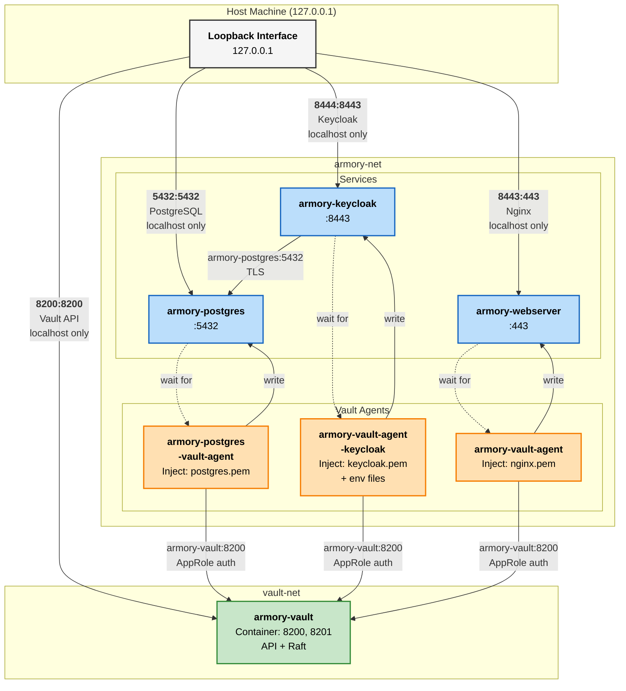

# Project Armory — Network & Port Map

## Overview

Project Armory uses a containerized architecture with services communicating over a shared Podman network. All services use TLS with certificates managed by Vault PKI.

---

## Network Topology Diagram



### Legend

- **Blue boxes (Services)**: Application containers
- **Orange boxes (Vault Agents)**: Sidecars that inject certificates & secrets
- **Green box (Vault)**: Central secrets & PKI management
- **Solid arrows**: Network communication
- **Dotted arrows**: Dependency relationships (health checks)
- **Port format**: `host_port:container_port`

---

## Network Architecture

### Primary Network: `armory-net`
- **Type**: Podman bridge network (external)
- **Driver**: bridge
- **Purpose**: Internal container-to-container communication
- **Note**: All services join this network for inter-service communication

---

## Services & Containers

### 1. Vault (Secret Management)
**Container Name**: `armory-vault`  
**Image**: `quay.io/openbao/openbao:2.5.2` (or HashiCorp Vault)  
**Network**: `vault-net` (separate network created by vault module)

#### Ports
| Binding | Protocol | Port | Access | Purpose |
|---------|----------|------|--------|---------|
| localhost | HTTPS | 8200 | Host only | Vault API & UI |
| Container internal | HTTPS | 8200 | Internal (armory-net) | Vault API for other services |
| Container internal | HTTPS | 8201 | Internal (not published) | Raft cluster communication (single-node only) |

**Note:** Port 8201 is used for Raft clustering but is **NOT published** to the host (no inter-node traffic in single-node deployment). See **ADR-007**.

#### Vault API Access Points
- **From Host**: `https://127.0.0.1:8200` (localhost only)
- **From Containers** (via armory-net): `https://armory-vault:8200`
- **TLS CA**: Vault generates its own self-signed CA (`/vault/tls/ca.crt`)

#### Environment Variables (for services)
```
VAULT_ADDR=https://armory-vault:8200
VAULT_CACERT=/vault/tls/ca.crt
BAO_ADDR=https://armory-vault:8200
BAO_CACERT=/vault/tls/ca.crt
```

---

### 2. PostgreSQL (Database)
**Container Name**: `armory-postgres`  
**Image**: `docker.io/postgres:16-alpine`  
**Network**: `armory-net`

#### Ports
| Internal | External | Protocol | Access | Purpose |
|----------|----------|----------|--------|---------|
| Container 5432 | 127.0.0.1:5432 | PostgreSQL | Host only | Database access |
| Container 5432 | armory-postgres:5432 | PostgreSQL | armory-net | Internal database |

#### Access Points
- **From Host**: `127.0.0.1:5432`
- **From Containers** (Keycloak, etc.): `armory-postgres:5432`
- **TLS**: Enabled with certificates from Vault PKI (internal CA)

#### TLS Certificate Details
- **CN**: `armory-postgres.armory.internal`
- **TTL**: 24 hours
- **Managed by**: Vault PKI `pki_int` mount

---

### 3. Keycloak (OIDC Identity Provider)
**Container Name**: `armory-keycloak`  
**Image**: `quay.io/keycloak/keycloak:24.0`  
**Network**: `armory-net`

#### Ports
| Internal | External | Protocol | Access | Purpose |
|----------|----------|----------|--------|---------|
| Container 8443 | `${host_ip}:${keycloak_port}` | HTTPS | Configurable | Keycloak UI & OIDC |

#### Configuration
- **Container listens on**: 8443 (standard HTTPS)
- **Default host_ip**: `127.0.0.1` (localhost only)
- **Default host_port**: 8444 (configurable via `keycloak_port` variable)
- **Actual binding**: `127.0.0.1:8444:8443` (host:container mapping)
- **Database**: PostgreSQL at `armory-postgres:5432`
- **Database**: Uses TLS connection with `ssl=true&sslmode=require`

#### TLS Certificate Details
- **CN**: `armory-keycloak`
- **TTL**: 720 hours (30 days)
- **Managed by**: Vault PKI `pki_ext` mount (external CA)

#### Database Connectivity
```
KC_DB_URL=jdbc:postgresql://armory-postgres:5432/keycloak?ssl=true&sslmode=require
KC_DB_USERNAME=keycloak
```

#### Keycloak Admin Credentials
- **Source**: Vault KV v2 at `kv/data/keycloak/admin`
- **Injected via**: Vault Agent sidecar

---

### 4. Nginx (Webserver / Reverse Proxy)
**Container Name**: `armory-webserver`  
**Image**: `docker.io/nginx:alpine`  
**Network**: `armory-net`

#### Ports
| Internal | External | Protocol | Access | Purpose |
|----------|----------|----------|--------|---------|
| Container 443 | `${host_ip}:${host_port}` | HTTPS | Configurable | HTTPS reverse proxy |

#### Configuration
- **Container listens on**: 443 (standard HTTPS)
- **Default host_ip**: `127.0.0.1` (localhost only)
- **Default host_port**: 8443 (configured for rootless Podman)
- **Actual binding**: `127.0.0.1:8443:443` (host:container mapping)

#### TLS Certificate Details
- **CN**: `armory-webserver`
- **TTL**: 720 hours (30 days)
- **Managed by**: Vault PKI `pki_ext` mount (external CA)

---

---

## Complete Port Reference

This section clarifies all port bindings using standard Podman compose notation: `host_ip:host_port:container_port`

| Service | Container | Port | Host Binding | Notes |
|---------|-----------|------|--------------|-------|
| Vault | armory-vault | 8200 (API) | 127.0.0.1:8200:8200 | Localhost only (ADR-007) |
| Vault | armory-vault | 8201 (Raft) | **NOT published** | Internal only, no inter-node traffic in single-node deployment |
| Keycloak | armory-keycloak | 8443 (HTTPS) | 127.0.0.1:8444:8443 | Default; customize with `host_ip` & `keycloak_port` |
| Nginx | armory-webserver | 443 (HTTPS) | 127.0.0.1:8443:443 | Default; customize with `host_ip` & `host_port` |
| PostgreSQL | armory-postgres | 5432 (TCP) | 127.0.0.1:5432:5432 | Localhost only (ADR-007) |

---

| From | To | Hostname | Port | Protocol | Purpose |
|------|-----|----------|------|----------|---------|
| All Services | Vault | `armory-vault` | 8200 | HTTPS | Secret retrieval, PKI, auth |
| Keycloak | PostgreSQL | `armory-postgres` | 5432 | PostgreSQL + TLS | Database queries |
| Vault Agent (Postgres) | Vault | `armory-vault` | 8200 | HTTPS | Certificate injection |
| Vault Agent (Keycloak) | Vault | `armory-vault` | 8200 | HTTPS | Certificate & secrets injection |
| Vault Agent (Nginx) | Vault | `armory-vault` | 8200 | HTTPS | Certificate injection |

---

## Vault Agent Sidecars

Each service includes a Vault Agent sidecar for certificate and secret injection.

### Vault Agent (Postgres Service)
**Container Name**: `armory-postgres-vault-agent` (or `armory-vault-agent-postgres`)  
**Image**: `quay.io/openbao/openbao:2.5.2`  
**Network**: `armory-net`

- **Config**: `/vault/agent/agent.hcl`
- **AppRole Auth**: Via AppRole credentials
- **Output**: `/vault/certs/postgres.pem` (combined cert + key)

### Vault Agent (Keycloak Service)
**Container Name**: `armory-vault-agent-keycloak`  
**Image**: `quay.io/openbao/openbao:2.5.2`  
**Network**: `armory-net`

- **Config**: `/vault/agent/agent.hcl`
- **AppRole Auth**: Via AppRole credentials
- **Outputs**:
  - `/vault/certs/keycloak.pem` (combined cert + key)
  - `/vault/secrets/keycloak.env` (database credentials)
  - `/vault/secrets/keycloak-admin.env` (admin credentials)

### Vault Agent (Nginx Service)
**Container Name**: `armory-vault-agent` (in webserver compose)  
**Image**: `quay.io/openbao/openbao:2.5.2`  
**Network**: `armory-net`

- **Config**: `/vault/agent/agent.hcl`
- **AppRole Auth**: Via AppRole credentials
- **Output**: `/vault/certs/nginx.pem` (combined cert + key)

---

## TLS/PKI Configuration

### Vault PKI Mounts

| Mount | Purpose | Default | Used By |
|-------|---------|---------|---------|
| `pki_int` | **Internal** intermediate CA | Mount path: `pki_int` | PostgreSQL, internal services |
| `pki_ext` | **External** intermediate CA | Mount path: `pki_ext` | Keycloak, Nginx (client-facing) |
| `approle` | AppRole authentication | Mount path: `approle` | Vault Agents in all services |

### Vault PKI Roles

| Role | Mount | Purpose | CN Pattern |
|------|-------|---------|------------|
| `armory-server` | `pki_int` | Internal service certs | `armory-*.armory.internal` |
| `armory-external` | `pki_ext` | External/public service certs | `armory-*` (any subdomain) |

### Certificate Details

| Service | CA | CN | TTL | Role |
|---------|----|----|-----|------|
| PostgreSQL | Internal | `armory-postgres.armory.internal` | 24h | `armory-server` |
| Keycloak | External | `armory-keycloak` | 720h | `armory-external` |
| Nginx | External | `armory-webserver` | 720h | `armory-external` |

---

### Default Configuration Summary

### Host Bindings (All Localhost by Default)

```
┌─────────────────────────────────────────────────┐
│ External Access (Host Bindings)                 │
├─────────────────────────────────────────────────┤
│ Vault       → 127.0.0.1:8200                    │
│ Keycloak    → 127.0.0.1:8444 (→ container 8443)│
│ Nginx       → 127.0.0.1:8443 (→ container 443) │
│ PostgreSQL  → 127.0.0.1:5432                    │
└─────────────────────────────────────────────────┘

┌─────────────────────────────────────────────────┐
│ Internal Container Network (armory-net)         │
├─────────────────────────────────────────────────┤
│ armory-vault:8200       (Vault API)             │
│ armory-vault:8201       (Raft - not published)  │
│ armory-postgres:5432    (PostgreSQL)            │
│ armory-keycloak:8443    (Keycloak HTTPS)        │
│ armory-webserver:443    (Nginx HTTPS)           │
└─────────────────────────────────────────────────┘
```

### Base Directory Structure

```
/opt/armory/
├── vault/
│   ├── config/
│   ├── data/          (Raft storage)
│   ├── tls/           (CA cert, server cert/key)
│   └── logs/
├── postgres/
│   ├── data/          (pgdata)
│   ├── certs/         (injected by Vault Agent)
│   └── config/
├── keycloak/
│   ├── certs/         (injected by Vault Agent)
│   ├── secrets/       (env files from Vault)
│   └── config/
└── webserver/
    ├── certs/         (injected by Vault Agent)
    ├── nginx/
    └── config/
```

---

## AppRole Authentication

Each service's Vault Agent authenticates via AppRole:

| Service | Role ID | Secret ID | Policy |
|---------|---------|-----------|--------|
| Postgres Agent | `approle/postgres` | (rotated) | `postgres_db`, `postgres_pki` |
| Keycloak Agent | `approle/keycloak` | (rotated) | `keycloak_db`, `keycloak_pki`, `kv_reader_keycloak` |
| Nginx Agent | `approle/nginx` | (rotated) | `nginx_pki` |

- **Mount**: `approle` (configurable)
- **Storage**: `.hcl` files in each service's `approle` directory
- **Renewal**: Automatic via Vault Agent

---

## Network Access Restrictions (Security)

Per **ADR-007 (No Host Port Publishing)**, the architecture enforces:

- ✅ **Internal container communication**: Via `armory-net` (no port publishing)
- ❌ **No raw port publishing**: Services don't bind ephemeral host ports directly
- ✅ **Controlled external access**: Only explicit `host_ip:host_port` bindings
- ✅ **Localhost default**: All external bindings default to `127.0.0.1` (loopback only)
- ✅ **TLS everywhere**: All inter-container communication uses TLS certificates

### To Enable External Access

Modify the relevant `.tfvars`:
```hcl
# For Keycloak
host_ip       = "0.0.0.0"  # or specific LAN IP
keycloak_port = 8444

# For Nginx
host_ip   = "192.168.1.50"  # or 0.0.0.0
host_port = 8443
```

---

## Environment Variables

### Vault Addresses (Used Everywhere)
- **From Host** (Terraform): `https://127.0.0.1:8200`
- **From Containers**: `https://armory-vault:8200`
- **TLS CA**: `/vault/tls/ca.crt`

### PostgreSQL Connection
- **Hostname**: `armory-postgres` (internal) or `127.0.0.1` (host)
- **Port**: `5432`
- **TLS Mode**: `require` (Keycloak enforces this)
- **JDBC URL** (Keycloak): `jdbc:postgresql://armory-postgres:5432/keycloak?ssl=true&sslmode=require`

### Service Names
- Vault: `armory-vault`
- PostgreSQL: `armory-postgres`
- Keycloak: `armory-keycloak`
- Nginx: `armory-webserver`

---

## Networking Notes

1. **No cross-network communication**: Vault runs on `vault-net`, other services on `armory-net`. Separation is intentional.
2. **DNS Resolution**: Container hostnames resolve via Podman's internal DNS on each network.
3. **TLS Verification**: All services verify Vault's CA cert (`/vault/tls/ca.crt`).
4. **Vault Agent health checks**: Services wait for Vault Agent to be healthy (certificates injected) before starting main service.
5. **Port 443 vs 8443**: Nginx internally listens on 443; the host binding is configurable (default 8443 for rootless Podman).
