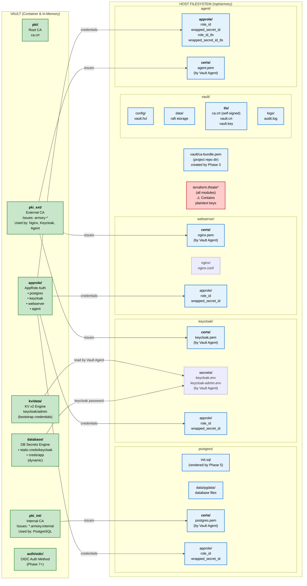

# Project Armory

A production-oriented infrastructure project building a cryptographic backbone for secrets management, PKI, and sensitive data storage. The foundation is a Vault deployment that all other services integrate with for certificate issuance, dynamic database credentials, and OIDC-backed operator login.

Currently using [OpenBao](https://openbao.org) and [OpenTofu](https://opentofu.org) as open-source stand-ins. The code is structured for a clean swap to HashiCorp Vault and Terraform when required for client environments.

> **Demo / local environment:** This project is a single-user learning environment. Two intentional limitations apply to all deployments: `terraform.tfstate` stores TLS private keys in plaintext on disk, and `vault.key` is world-readable by all local users. These trade-offs are [documented in detail below](#security-trade-offs) (see also [ADR-012](docs/ADR/ADR-012-local-tfstate-demo-limitation.md) and [ADR-005](docs/ADR/ADR-005-world-readable-tls-artifacts.md)). **Do not use this configuration on a shared host or as a production baseline without first migrating to remote encrypted state and tightening host permissions.**

---

## Requirements

| Tool | Minimum version | Notes |
|---|---|---|
| [OpenTofu](https://opentofu.org/docs/intro/install/) | 1.8.0 | `tofu` must be on `$PATH` |
| [Podman](https://podman.io/docs/installation) | 4.0 | `podman` must be on `$PATH` |
| [podman-compose](https://github.com/containers/podman-compose) | 1.0 | `podman compose` plugin or `podman-compose` |
| [Python](https://python.org) | 3.12+ | Required by the agent API and `cli.py` |
| Linux kernel | — | `IPC_LOCK` for mlock; set `disable_mlock = true` if unavailable (some WSL2 setups) |

The Vault/OpenBao CLI is **not** required on the host — all init and unseal operations are run via `podman exec`. If you do have the CLI installed, set `VAULT_CACERT` to the generated CA bundle path before use.

---

## Configuration

All deployment-time configuration lives in a single shell file: **`armory.env`**.

### Setup

```bash
cp example.armory.env armory.env
# Edit armory.env with your desired values (passwords, ports, IP addresses)
```

`armory.env` is gitignored and never committed. `example.armory.env` is the committed template showing every configurable value with safe demo defaults.

### How it works

`rebuild.sh` sources `armory.env` automatically at startup. The file exports two categories of variables:

**`ARMORY_*` variables** — used directly by `rebuild.sh` for health-check URLs, port references, and the post-build summary.

**`TF_VAR_*` variables** — picked up automatically by every `tofu apply` call across all modules (this is OpenTofu's built-in cross-module env mechanism, no `-var-file` flag needed).

### What each variable controls

| Variable | Module(s) | Description |
|---|---|---|
| `ARMORY_HOST_IP` / `TF_VAR_api_addr` / `TF_VAR_host_ip` | vault/, webserver, keycloak, agent, wazuh | Host IP that services bind to. `127.0.0.1` = loopback only; `0.0.0.0` = all interfaces. |
| `ARMORY_VAULT_PORT` / `TF_VAR_vault_port` | vault/, vault-config/, keycloak | Vault API port. Also used to derive OIDC redirect URIs. Default: `8200` |
| `TF_VAR_vault_cluster_port` | vault/ | Internal Raft cluster port. Not published to host. Default: `8201` |
| `ARMORY_WEBSERVER_PORT` / `TF_VAR_nginx_host_port` | services/webserver/ | Host port for nginx HTTPS. Default: `8000` |
| `ARMORY_KEYCLOAK_PORT` / `TF_VAR_keycloak_port` | services/keycloak/ | Host port for Keycloak HTTPS. Default: `8443` |
| `ARMORY_AGENT_PORT` / `TF_VAR_agent_host_port` | services/agent/ | Host port for the agent API HTTPS. Default: `8445` |
| `ARMORY_WAZUH_API_PORT` / `TF_VAR_wazuh_api_port` | services/wazuh/ | Host port for direct Wazuh manager API HTTPS. Default: `55000` |
| `ARMORY_WAZUH_AUTH_PORT` / `TF_VAR_wazuh_auth_proxy_port` | services/keycloak/, services/wazuh/ | Host port for Keycloak-protected Wazuh oauth2-proxy endpoint. Default: `8550` |
| `ARMORY_PG_PORT` / `TF_VAR_postgres_port` | vault-config/, services/postgres/, services/keycloak/ | PostgreSQL port. Default: `5432` |
| `TF_VAR_operator_username` | vault-config/ | Vault userpass account username. Default: `operator` |
| `TF_VAR_operator_password` | vault-config/ | Vault userpass account password. **Required — no default.** |
| `TF_VAR_oidc_client_id` | vault-config/ | OIDC client ID registered in Keycloak. Default: `vault` |
| `TF_VAR_oidc_client_secret` | vault-config/ | OIDC client secret. **Required when OIDC is enabled.** |
| `TF_VAR_vault_oidc_client_secret` | services/keycloak/ | Same value as `TF_VAR_oidc_client_secret` — different variable name in the keycloak module. Set together in armory.env. |
| `TF_VAR_wazuh_oidc_client_secret` | services/keycloak/, services/wazuh/ | Client secret for the Wazuh `wazuh-dashboard` Keycloak client. Must match between the Keycloak realm import and the Wazuh module. |
| `TF_VAR_wazuh_cookie_secret` | services/wazuh/ | Base64-encoded oauth2-proxy cookie secret for Wazuh. Must decode to 16, 24, or 32 bytes. |
| `TF_VAR_keycloak_realm` | vault-config/ | Realm name in the OIDC discovery URL. Default: `armory` |
| `TF_VAR_postgres_username` | services/postgres/ | PostgreSQL superuser name (`POSTGRES_USER`). Default: `postgres` |
| `TF_VAR_postgres_password` | services/postgres/ | PostgreSQL superuser password. **Required — no default.** |
| `TF_VAR_vault_mgmt_username` | vault-config/, services/postgres/ | PostgreSQL role used by Vault's database secrets engine. Must match between modules. Default: `vault_mgmt` |
| `TF_VAR_vault_mgmt_password` | vault-config/, services/postgres/ | Password for the `vault_mgmt` role. **Required — no default.** Must match between modules. |
| `TF_VAR_keycloak_db_username` | vault-config/, services/postgres/, services/keycloak/ | PostgreSQL login role for Keycloak, managed by Vault's static database role. Must match across all three modules. Default: `keycloak` |
| `TF_VAR_vault_agent_addr` | services/postgres/, services/webserver/, services/keycloak/, services/agent/ | Vault address reachable from inside the agent sidecar containers (container-to-container). Default: `https://armory-vault:<ARMORY_VAULT_PORT>` |
| `TF_VAR_keycloak_admin_username` | vault-config/ | Keycloak bootstrap admin username stored in KV v2. Default: `admin` |
| `TF_VAR_keycloak_admin_password` | vault-config/ | Keycloak bootstrap admin password stored in KV v2. **Required — no default.** |
| `TF_VAR_realm_operator_username` | services/keycloak/ | Username for the demo operator user seeded in the Keycloak realm. Default: `operator` |
| `TF_VAR_realm_operator_password` | services/keycloak/ | Password for the demo operator user. **Required — no default.** |
| `TF_VAR_keycloak_oidc_client_id` | services/keycloak/, services/wazuh/ | Keycloak OIDC client ID used by oauth2-proxy in front of Wazuh. Default: `wazuh-dashboard` |
| `TF_VAR_required_group` | services/keycloak/, services/wazuh/ | Keycloak group required to access Wazuh via oauth2-proxy. Default: `wazuh-operators` |
| `TF_VAR_wazuh_operator_username` | services/keycloak/ | Username for the seeded Wazuh demo user in the Keycloak realm. Default: `wazuh-operator` |
| `TF_VAR_wazuh_operator_password` | services/keycloak/ | Password for the seeded Wazuh demo user. **Required — no default.** |
| `TF_VAR_vault_addr` | All vault-provider modules | Vault API address reachable from the host. Derived from `ARMORY_HOST_IP` and `ARMORY_VAULT_PORT`. |
| `TF_VAR_armory_base_dir` | All modules | Root directory for all runtime artefacts. Default: `/opt/armory` |

> **Changing ports:** If you change any port in `armory.env`, also update the corresponding firewall rules in the `Vagrantfile` (`02-firewall` provisioner) and re-provision: `vagrant provision --provision-with 02-firewall`

---

## Deployment

Deployment is a multi-phase process. Each phase has its own OpenTofu module and state file. **Modules must be applied in order** — later modules depend on earlier ones being in place.

### Deployment Phases & Dependencies

```mermaid
graph TD
    Start["🚀 START<br/>Create /opt/armory"] --> Phase0["<b>Phase 0</b><br/>Setup host directory"]
    
    Phase0 --> Phase1["<b>Phase 1</b><br/>Deploy Vault<br/><code>vault/</code>"]
    Phase1 --> HC1["✓ Health Check<br/>Vault API alive"]
    
    HC1 --> Phase2["<b>Phase 2</b><br/>Key Ceremony<br/><code>bao operator init</code><br/><code>bao operator unseal</code>"]
    Phase2 --> HC2["✓ Verify<br/><code>bao status</code><br/>Unsealed"]
    
    HC2 --> Phase3["<b>Phase 3</b><br/>Configure Vault<br/><code>vault-config/</code><br/><br/>Creates:<br/>• PKI hierarchy<br/>• AppRole auth<br/>• Database connection<br/>• Policies"]
    Phase3 --> HC3["✓ Vault Ready<br/>PKI + AppRole<br/>configured"]
    
    HC3 --> Decision1{Deploy optional<br/>webserver?}
    Decision1 -->|Yes| Phase4["<b>Phase 4</b><br/>Deploy Nginx<br/><code>services/webserver/</code>"]
    Decision1 -->|No/Skip| SkipPhase4["⊘ Skip Phase 4"]
    Phase4 --> HC4["✓ Nginx ready<br/>Certificate injected<br/>by Vault Agent"]
    HC4 --> Phase5
    SkipPhase4 --> Phase5
    
    Phase5["<b>Phase 5</b><br/>Deploy PostgreSQL<br/><code>services/postgres/</code>"] --> HC5A["✓ pg_isready<br/>Database healthy"]
    HC5A --> HC5B["✓ DNS resolv check<br/><code>armory-postgres</code><br/>resolvable from<br/>Vault container"]
    
    HC5B --> Phase5b["<b>Phase 5b (RE-APPLY)</b><br/>Enable Database Roles<br/><code>vault-config/</code><br/>with<br/>database_roles_enabled=true<br/><br/>Creates:<br/>• Static role: keycloak<br/>• Dynamic role: app"]
    Phase5b --> HC5b["✓ Database roles<br/>created + verified"]
    
    HC5b --> Decision2{Deploy Keycloak<br/>+ OIDC?}
    Decision2 -->|Yes| Phase6["<b>Phase 6</b><br/>Deploy Keycloak<br/><code>services/keycloak/</code>"]
    Decision2 -->|No/Skip| SkipPhase6["⊘ Skip Phases 6-9"]
    
    Phase6 --> HC6["✓ Keycloak ready<br/>• Cert injected<br/>• DB password ready<br/>• Admin creds ready"]
    HC6 --> HC6b["✓ Realm import<br/>Seeded:<br/>• Realm: armory<br/>• Group: vault-operators<br/>• OIDC clients: vault + agent-cli"]
    
    HC6b --> Phase7["<b>Phase 7 (AUTOMATED)</b><br/>Enable Vault OIDC Auth<br/>Re-apply: <code>vault-config/</code><br/>with oidc_enabled=true"]
    Phase7 --> HC7["✓ OIDC auth ready<br/>Operators can login<br/>via Keycloak"]
    
    HC7 --> Decision3{Deploy agentic<br/>layer?}
    Decision3 -->|Yes| Phase9["<b>Phase 9</b><br/>Deploy Agent Layer<br/>Re-apply: <code>vault-config/</code><br/>with agent_enabled=true<br/>Then: <code>services/agent/</code>"]
    Decision3 -->|No/Skip| SkipPhase9["⊘ Skip Phase 9"]
    
    Phase9 --> HC9["✓ Agent ready<br/>TLS sidecar + HTTPS API"]
    
    SkipPhase6 --> End["✅ COMPLETE"]
    SkipPhase9 --> End
    HC9 --> End
    
    classDef automated fill:#c8e6c9,stroke:#388e3c,stroke-width:2px,color:#000
    classDef healthCheck fill:#bbdefb,stroke:#1976d2,stroke-width:1px,color:#000
    classDef skip fill:#f5f5f5,stroke:#999,stroke-width:1px,color:#666,stroke-dasharray: 5 5
    classDef decision fill:#f8bbd0,stroke:#c2185b,stroke-width:2px,color:#000
    
    class Phase1,Phase2,Phase3,Phase4,Phase5,Phase5b,Phase6,Phase7,Phase9 automated
    class HC1,HC2,HC3,HC4,HC5A,HC5B,HC5b,HC6,HC6b,HC7,HC9 healthCheck
    class SkipPhase4,SkipPhase6,SkipPhase9 skip
    class Decision1,Decision2,Decision3 decision
```



### Key Dependencies & Readiness Gates

| Phase | Depends On | Readiness Gate |
|-------|-----------|----------------|
| **Phase 2** | Phase 1 | Vault API returns any HTTP response on the health endpoint |
| **Phase 3** | Phase 2 | Vault is unsealed (`bao status` shows `Sealed: false`) |
| **Phase 4** | Phase 3 | PKI hierarchy exists; Vault Agent can request certs from `pki_ext` |
| **Phase 5** | Phase 3 | Vault Database engine connection is configured (PostgreSQL not yet running) |
| **Phase 5b** | Phase 5 | `pg_isready` passes inside the container AND `armory-postgres` is DNS-resolvable from inside the Vault container |
| **Phase 6** | Phase 5b | Vault can issue the static keycloak DB password |
| **Phase 7** | Phase 6 | Keycloak `/health/ready` returns HTTP 200; realm import has completed |
| **Phase 9** | Phase 3 + Phase 7 | OIDC auth is enabled; Keycloak is running |

---

## Automated rebuild (recommended)

`rebuild.sh` is the single entry point for a complete teardown and rebuild of the entire stack. It sources `armory.env`, destroys all existing state, then applies every phase in the correct order with readiness gates between phases.

```bash
# First time setup
cp example.armory.env armory.env
# Edit armory.env — at minimum change the passwords from the demo values

./rebuild.sh
```

**Options:**

| Flag | Effect |
|------|--------|
| `--skip-webserver` | Skip Phase 4 (nginx demo). Useful when you only need the core vault/db/auth stack. |
| `--skip-keycloak` | Skip Phases 6, 7, and 9 (Keycloak, OIDC, and the agentic layer). |
| `--skip-agent` | Skip Phase 9 only. Keycloak and OIDC are still deployed. |
| `--skip-wazuh` | Skip Phase 10 only. Keycloak remains deployed, but Wazuh SIEM is not applied. |
| `--destroy-only` | Run teardown without rebuilding. |
| `--base-dir PATH` | Override the runtime artefact root (default: `/opt/armory`). Also settable via `ARMORY_BASE_DIR` env var. |

After `rebuild.sh` completes, the full stack is operational: Vault unsealed, PKI configured, PostgreSQL running, Keycloak running with the `armory` realm imported, OIDC auth enabled, the HTTPS agent API live, and (unless skipped) Wazuh deployed with Keycloak-protected access.

---

## Filesystem & Secrets Architecture



### Secret flows

**Certificate injection (every service):**
```
Vault PKI engine
  → AppRole-authenticated Vault Agent sidecar
  → Template rendered to combined PEM (cert + CA chain + key)
  → Written to host-path volume (rw)
  → Bind-mounted read-only into the main service container
  → Service startup blocked by healthcheck until file appears
```

**Database credential injection (Keycloak):**
```
Vault Database engine (static role)
  → AppRole-authenticated Vault Agent sidecar
  → Template rendered to keycloak.env (KC_DB_PASSWORD=...)
  → Written to host-path volume (rw)
  → Bind-mounted read-only into Keycloak container
  → Vault Agent re-renders on each credential rotation
```

**Admin bootstrap credentials (Keycloak first-boot only):**
```
Vault KV v2 (kv/data/keycloak/admin)
  → AppRole-authenticated Vault Agent sidecar
  → Template rendered to keycloak-admin.env
  → Keycloak reads KC_BOOTSTRAP_ADMIN_* on first start only
```

### Filesystem layout

| Directory | Created by | Purpose | Notes |
|-----------|-----------|---------|-------|
| `/opt/armory/vault/tls/` | Phase 1 | Self-signed CA + server cert/key | ⚠️ Private key on disk (ADR-005) |
| `/opt/armory/vault/data/` | Phase 1 | Raft storage | Persistent across restarts |
| `/opt/armory/vault/logs/` | Phase 1 | Vault audit log | JSON-formatted |
| `/opt/armory/postgres/certs/` | Vault Agent (Phase 5) | TLS cert from `pki_int` | Read-only to PostgreSQL |
| `/opt/armory/keycloak/certs/` | Vault Agent (Phase 6) | TLS cert from `pki_ext` | Read-only to Keycloak |
| `/opt/armory/keycloak/secrets/` | Vault Agent (Phase 6) | DB password + admin bootstrap creds | Read-only to Keycloak |
| `/opt/armory/webserver/certs/` | Vault Agent (Phase 4) | TLS cert from `pki_ext` | Read-only to nginx |
| `/opt/armory/agent/certs/` | Vault Agent (Phase 9) | TLS cert from `pki_ext` | Used by the FastAPI container |
| `/opt/armory/agent/approle/` | Phase 9 (tofu) | Four credential files (role_id + two wrapped tokens) | See below |
| `vault/ca-bundle.pem` | Phase 3 (vault-config) | Consolidated trust anchor for all Armory CAs | Use with `--cacert` or system trust store |
| `terraform.tfstate*` | All phases | OpenTofu state | ⚠️ Contains TLS private keys in plaintext |

**Agent AppRole credential files** — the agent module writes four files to distinguish the API runtime from the TLS sidecar (each wrapped token is single-use; using two prevents the sidecar consuming the API's token):

| File | Used by |
|------|---------|
| `role_id` | Agent API container (OIDC + DB credential flow) |
| `wrapped_secret_id` | Agent API container — unwrapped on first use |
| `role_id_tls` | Vault Agent TLS sidecar |
| `wrapped_secret_id_tls` | Vault Agent TLS sidecar — unwrapped on first use |

---

## Phase-by-phase manual instructions

Use these if you need to apply a single phase in isolation, debug a failure, or understand exactly what `rebuild.sh` does.

> Before running any `tofu apply` manually, source `armory.env` so all `TF_VAR_*` variables are in scope:
> ```bash
> source armory.env
> ```

### Teardown

`rebuild.sh --destroy-only` handles a complete teardown in the correct reverse-dependency order. For manual cleanup:

```bash
# Destroy modules in reverse order
cd services/agent    && tofu destroy -auto-approve; cd ../..
cd services/keycloak && tofu destroy -auto-approve; cd ../..
cd services/webserver && tofu destroy -auto-approve; cd ../..
cd vault-config      && tofu destroy -auto-approve; cd ..
cd services/postgres && tofu destroy -auto-approve; cd ../..
cd vault             && tofu destroy -auto-approve; cd ..

# Force-remove any lingering containers
podman ps -a --format '{{.Names}}' | grep '^armory-' | xargs -r podman rm -f

# Remove the network
podman network rm armory-net 2>/dev/null || true

# Remove all Podman volumes
podman volume ls -q | xargs -r podman volume rm -f

# Purge the runtime directory (requires sudo for container-owned subdirs)
sudo rm -rf /opt/armory

# Remove all state files
find . -name 'terraform.tfstate*' -not -path '*/.terraform/*' -delete
find . -type d -name '.terraform' -prune -exec rm -rf {} +
find . -name 'terraform.tfvars' -delete
```

---

### Phase 0 — Host prerequisite (one-time)

```bash
sudo mkdir -p /opt/armory
sudo chown "$USER:$USER" /opt/armory
```

Skip if you set `ARMORY_BASE_DIR` to a path you already own (e.g. `~/armory`).

---

### Phase 1 — Deploy Vault

```bash
source armory.env
cd vault/
cp example.tfvars terraform.tfvars   # inspect and adjust image tags or TLS SANs if needed
tofu init
tofu apply -var deploy_dir="$ARMORY_BASE_DIR/vault"
```

OpenTofu generates a self-signed TLS CA and server certificate, writes `vault.hcl`, renders `compose.yml`, and starts the OpenBao container. After this phase Vault is running but uninitialised (HTTP 501 on the health endpoint).

---

### Phase 2 — Key ceremony (once only)

`rebuild.sh` handles this automatically. For manual runs:

```bash
# Wait for the API to respond, then initialise
podman exec armory-vault bao operator init -key-shares=1 -key-threshold=1

# Unseal with the key printed above
podman exec armory-vault bao operator unseal <UNSEAL_KEY>

# Export the root token for subsequent phases
export TF_VAR_vault_token=<ROOT_TOKEN>
```

Save the **Unseal Key** and **Root Token** somewhere secure (e.g. a password manager). They cannot be recovered from Vault itself. **Vault must be manually unsealed after every restart.**

---

### Phase 3 — Configure Vault

```bash
source armory.env
export TF_VAR_vault_token=<ROOT_TOKEN>
cd vault-config/
cp example.tfvars terraform.tfvars   # first time only
tofu init
tofu apply -var armory_base_dir="$ARMORY_BASE_DIR"
```

This phase builds the entire Vault logical configuration:

- **PKI hierarchy** — three-tier: `pki/` (root CA, 10-year) → `pki_int/` (internal intermediate, signs `*.armory.internal`) → `pki_ext/` (external intermediate, signs service certs)
- **AppRole auth** — one role per service, each with least-privilege policy
- **Userpass auth** — operator bootstrap account (username/password from `armory.env`)
- **KV v2 engine** — stores Keycloak admin bootstrap credentials
- **Database secrets engine** — connection to `armory-postgres` configured, but no roles yet (PostgreSQL is not running)
- **ACL policies** — one per service, scoped to its PKI role, DB credential path, or KV path
- **`vault/ca-bundle.pem`** — consolidated CA bundle written to the project repo directory

> **Database roles are deferred to Phase 5b.** Creating a static role requires Vault to open a live TCP connection to PostgreSQL immediately. Phase 5b re-applies vault-config once PostgreSQL is confirmed healthy.

After the first apply, re-apply with the Vault TLS CA to create the consolidated trust bundle:

```bash
tofu apply \
  -var armory_base_dir="$ARMORY_BASE_DIR" \
  -var "vault_tls_cacert_path=$ARMORY_BASE_DIR/vault/tls/ca.crt"
```

This adds the Vault server TLS CA into `vault/ca-bundle.pem` so a single file covers all Armory services.

---

### Phase 4 — Deploy the webserver (optional demo)

```bash
source armory.env
export TF_VAR_vault_token=<ROOT_TOKEN>
cd services/webserver/
cp example.tfvars terraform.tfvars
tofu init
tofu apply \
  -var armory_base_dir="$ARMORY_BASE_DIR" \
  -var deploy_dir="$ARMORY_BASE_DIR/webserver"
```

nginx on the configured port with a Vault Agent sidecar that fetches and auto-rotates a TLS certificate from `pki_ext`. Demonstrates the sidecar pattern without any application complexity. Reachable at `https://${ARMORY_HOST_IP}:${ARMORY_WEBSERVER_PORT}`.

> Rootless Podman cannot bind to privileged ports (< 1024), so port 443 is not used.

---

### Phase 5 — Deploy PostgreSQL

```bash
source armory.env
export TF_VAR_vault_token=<ROOT_TOKEN>
cd services/postgres/
cp example.tfvars terraform.tfvars
tofu init
tofu apply \
  -var armory_base_dir="$ARMORY_BASE_DIR" \
  -var deploy_dir="$ARMORY_BASE_DIR/postgres"
```

Deploys PostgreSQL 16 with TLS enabled. The Vault Agent sidecar authenticates via AppRole, issues a TLS certificate from `pki_int`, and writes it to the `certs/` volume before PostgreSQL starts.

The `init.sql` script (rendered from a template by tofu) creates:

- The `keycloak` and `app` databases, each with a matching login role
- The `vault_mgmt` superuser — used by Vault's Database secrets engine to rotate passwords and issue dynamic credentials

Usernames are drawn from `TF_VAR_vault_mgmt_username` and `TF_VAR_keycloak_db_username` in `armory.env`. Both must match the corresponding variables in `vault-config/` and `services/keycloak/`.

**Verify:**
```bash
podman exec armory-postgres psql -U postgres -c "\du"   # shows vault_mgmt role
podman exec armory-postgres psql -U postgres -c "\l"    # shows keycloak + app databases
```

---

### Phase 5b — Enable database roles (re-apply vault-config)

> **Wait for Phase 5 to be fully healthy first.** Vault immediately opens a TCP connection to `armory-postgres` when the static role is created. If the container is not yet reachable, `tofu apply` fails with a 500 error from the Vault API.

```bash
source armory.env
export TF_VAR_vault_token=<ROOT_TOKEN>
cd vault-config/
tofu apply \
  -var armory_base_dir="$ARMORY_BASE_DIR" \
  -var database_roles_enabled=true
```

Creates two database roles:

- **`database/static-roles/keycloak`** — Vault manages the `keycloak` PostgreSQL user's password and rotates it on a schedule. The Keycloak Vault Agent sidecar reads this path to populate `KC_DB_PASSWORD` in `keycloak.env`.
- **`database/roles/app`** — Dynamic role that creates short-lived `app_*` users with SELECT/INSERT/UPDATE/DELETE on the `app` database. The agentic layer issues and revokes these credentials per-task.

**Verify:**
```bash
podman exec -e VAULT_TOKEN=$TF_VAR_vault_token armory-vault bao list database/static-roles  # keycloak
podman exec -e VAULT_TOKEN=$TF_VAR_vault_token armory-vault bao list database/roles          # app
podman exec -e VAULT_TOKEN=$TF_VAR_vault_token armory-vault bao read database/creds/app      # issues test creds
```

---

### Phase 6 — Deploy Keycloak

```bash
source armory.env
export TF_VAR_vault_token=<ROOT_TOKEN>
cd services/keycloak/
cp example.tfvars terraform.tfvars
tofu init
tofu apply \
  -var armory_base_dir="$ARMORY_BASE_DIR" \
  -var deploy_dir="$ARMORY_BASE_DIR/keycloak"
```

Starts Keycloak on `${ARMORY_HOST_IP}:${ARMORY_KEYCLOAK_PORT}` with a Vault Agent sidecar that renders three files before Keycloak starts:

| File | Source | Contains |
|------|--------|---------|
| `certs/keycloak.pem` | `pki_ext` PKI engine | TLS cert + CA chain + private key (combined PEM) |
| `secrets/keycloak.env` | `database/static-creds/keycloak` | `KC_DB_PASSWORD` — auto-rotated by Vault |
| `secrets/keycloak-admin.env` | `kv/data/keycloak/admin` | `KC_BOOTSTRAP_ADMIN_USERNAME` + `KC_BOOTSTRAP_ADMIN_PASSWORD` |

Keycloak does not start until the sidecar healthcheck confirms both the TLS cert and the DB credentials file are present and non-empty.

OpenTofu also renders `templates/realm-armory.json.tpl` into the import directory before the container starts. Keycloak reads it on first boot (via `--import-realm`) and seeds the realm automatically — no manual Keycloak UI steps required.

**What the realm import creates:**

| Object | Value |
|--------|-------|
| Realm | `armory` (from `TF_VAR_keycloak_realm`) |
| Group | `vault-operators` |
| Demo operator user | username from `TF_VAR_realm_operator_username`, member of `vault-operators` |
| Confidential OIDC client | `vault` — redirect URIs derived from `ARMORY_VAULT_PORT` |
| Public OIDC client | `agent-cli` — PKCE S256, used by `cli.py` |

---

### Phase 7 — Enable Vault OIDC auth (automated by rebuild.sh)

Once Keycloak is healthy, re-apply vault-config with OIDC enabled:

```bash
source armory.env
export TF_VAR_vault_token=<ROOT_TOKEN>
cd vault-config/
tofu apply \
  -var armory_base_dir="$ARMORY_BASE_DIR" \
  -var oidc_enabled=true \
  -var database_roles_enabled=true \
  -var userpass_enabled=true
```

The `TF_VAR_oidc_client_secret` from `armory.env` is picked up automatically. Vault connects to Keycloak's OIDC discovery endpoint (`https://armory-keycloak:8443/realms/armory/.well-known/openid-configuration`) to validate the configuration immediately on apply.

**Verify:**
```bash
export VAULT_ADDR="${ARMORY_VAULT_ADDR}"
export VAULT_CACERT="$(pwd)/vault/ca-bundle.pem"
bao login -method=oidc role=operator
```

---

### Phase 9 — Deploy the agentic layer

Phase 9 is two steps. Both are automated by `rebuild.sh`.

**Step 1 — Enable the agent AppRole in vault-config:**

```bash
source armory.env
export TF_VAR_vault_token=<ROOT_TOKEN>
cd vault-config/
tofu apply \
  -var armory_base_dir="$ARMORY_BASE_DIR" \
  -var agent_enabled=true \
  -var database_roles_enabled=true \
  -var oidc_enabled=true
```

All three flags must be `true` together: omitting any one would cause OpenTofu to destroy that resource on the next apply.

**Step 2 — Deploy the HTTPS agent API and Vault Agent TLS sidecar:**

```bash
source armory.env
export TF_VAR_vault_token=<ROOT_TOKEN>
cd services/agent/
cp example.tfvars terraform.tfvars
tofu init
tofu apply \
  -var armory_base_dir="$ARMORY_BASE_DIR" \
  -var deploy_dir="$ARMORY_BASE_DIR/agent"
```

This writes AppRole credentials to `/opt/armory/agent/approle/`, starts the Vault Agent TLS sidecar which renders a certificate to `/opt/armory/agent/certs/agent.pem`, and starts the FastAPI container at `https://${ARMORY_HOST_IP}:${ARMORY_AGENT_PORT}`.

**Verify:**
```bash
curl --cacert vault/ca-bundle.pem "https://${ARMORY_HOST_IP}:${ARMORY_AGENT_PORT}/health"
```

**Submit a task:**
```bash
cd services/agent/agent/
export AGENT_API_URL="https://${ARMORY_HOST_IP}:${ARMORY_AGENT_PORT}"
python cli.py --query "SELECT current_user, now() AS ts"
```

`cli.py` opens a browser to the Keycloak login page, completes Authorization Code + PKCE, and submits the task. The response includes a `request_id` for correlating with the Vault audit log.

> **Headless / no-GUI environments:** `cli.py` prints the full authorization URL to stderr before attempting to open a browser. Copy-paste it into a browser on your host machine. The callback listener on `http://127.0.0.1:18080/callback` completes the exchange once you log in.

> **Single-use wrapped tokens:** `wrapped_secret_id` and `wrapped_secret_id_tls` are single-use. Re-run `tofu apply` in `services/agent/` to re-issue both when rotating or restarting the agent stack.

---

### Phase 10 — Deploy Wazuh SIEM + Keycloak auth proxy

This phase deploys `services/wazuh/` with four containers:

- Wazuh manager for SIEM ingestion and analysis
- Vault Agent sidecar for TLS cert and OIDC secret rendering
- oauth2-proxy for Keycloak-based human authentication
- Observer sidecar that emits JSON health/perf checks for Vault, Keycloak, and PostgreSQL

```bash
source armory.env
export TF_VAR_vault_token=<ROOT_TOKEN>
cd services/wazuh/
cp example.tfvars terraform.tfvars
tofu init
tofu apply \
  -var armory_base_dir="$ARMORY_BASE_DIR" \
  -var deploy_dir="$ARMORY_BASE_DIR/wazuh"
```

Keycloak bootstrap for Wazuh is automated by `services/keycloak/` during the realm import. After `rebuild.sh` finishes, the `armory` realm already contains:

1. Group `${TF_VAR_required_group}`
2. Confidential client `${TF_VAR_keycloak_oidc_client_id}`
3. Redirect URI `https://${ARMORY_HOST_IP}:${ARMORY_WAZUH_AUTH_PORT}/oauth2/callback`
4. Web origin `https://${ARMORY_HOST_IP}:${ARMORY_WAZUH_AUTH_PORT}`
5. Demo user `${TF_VAR_wazuh_operator_username}` in `${TF_VAR_required_group}`

Wazuh now seeds oauth2-proxy secrets into Vault during `services/wazuh` apply. Ensure these variables are set in `armory.env` before running `rebuild.sh`:

```bash
export TF_VAR_wazuh_oidc_client_secret="armory-wazuh-oidc-secret-2026"
export TF_VAR_wazuh_operator_username="wazuh-operator"
export TF_VAR_wazuh_operator_password="armory-demo-2026"
export TF_VAR_wazuh_cookie_secret=<32_BYTE_BASE64>
```

Verify:

```bash
curl -I --cacert vault/ca-bundle.pem "https://${ARMORY_HOST_IP}:${ARMORY_WAZUH_AUTH_PORT}/oauth2/sign_in"
curl -k "https://${ARMORY_HOST_IP}:${ARMORY_WAZUH_API_PORT}"
```

---

### Optional hardening — retire userpass

Once you have confirmed OIDC login works, disable the bootstrap userpass method:

```bash
source armory.env
export TF_VAR_vault_token=<ROOT_TOKEN>
cd vault-config/
tofu apply \
  -var armory_base_dir="$ARMORY_BASE_DIR" \
  -var oidc_enabled=true \
  -var agent_enabled=true \
  -var database_roles_enabled=true \
  -var userpass_enabled=false
```

> **Never disable userpass before confirming OIDC works.** If OIDC breaks and userpass is gone, the only recovery path is the root token from the key ceremony file.

---

## Connecting to services

All Armory services use TLS. Two CA files cover all certs in the stack:

| File | Covers |
|------|--------|
| `/opt/armory/vault/tls/ca.crt` | Vault server TLS only (self-signed by OpenTofu `tls` provider) |
| `vault/ca-bundle.pem` | All PKI-issued certs — Keycloak, nginx, agent, PostgreSQL, plus Vault TLS CA when `vault_tls_cacert_path` was passed |

`rebuild.sh` always runs the Phase 3 re-apply with `vault_tls_cacert_path` set, so `vault/ca-bundle.pem` is the single trust anchor for all services.

### Trust the CA bundle system-wide (Fedora / RHEL)

```bash
sudo cp vault/ca-bundle.pem /etc/pki/ca-trust/source/anchors/armory-ca-bundle.crt
sudo update-ca-trust
```

### Connect to Vault

```bash
# From the host CLI
export VAULT_ADDR="https://127.0.0.1:${ARMORY_VAULT_PORT:-8200}"
export VAULT_CACERT="$(pwd)/vault/ca-bundle.pem"
bao status

# Via the container directly
podman exec armory-vault bao status
podman exec -e VAULT_TOKEN=<TOKEN> armory-vault bao <command>

# Userpass login (before OIDC, or alongside it)
bao login -method=userpass username="${TF_VAR_operator_username:-operator}"

# OIDC login (after Phase 7)
bao login -method=oidc role="${TF_VAR_operator_username:-operator}"
```

The Vault UI is at `https://127.0.0.1:${ARMORY_VAULT_PORT:-8200}/ui`.

### Connect to Keycloak

```bash
# Health check
curl --cacert vault/ca-bundle.pem \
  "https://127.0.0.1:${ARMORY_KEYCLOAK_PORT:-8443}/health/ready"

# Admin console
open "https://127.0.0.1:${ARMORY_KEYCLOAK_PORT:-8443}/admin"
# Login with TF_VAR_keycloak_admin_username / TF_VAR_keycloak_admin_password
```

### View the audit log

```bash
tail -f /opt/armory/vault/logs/audit.log | python3 -m json.tool
```

All credential issuance, KV reads, OIDC logins, and PKI operations are logged here in JSON.

---

## Switching to HashiCorp Vault

Change four variables in `vault/terraform.tfvars` and re-apply:

```hcl
image_registry = "docker.io/hashicorp"
image_name     = "vault"
image_tag      = "1.18.3"
vault_binary   = "vault"
```

The `vault_audit` resource in `vault-config/audit.tf` is commented out — uncomment it if using HashiCorp Vault (the file audit backend API is available there but blocked in OpenBao 2.x).

---

## Testing

### Module-level tests (`tofu test`)

Fast, no infrastructure required. Run from each module directory:

```bash
cd vault/              && tofu test   # TLS SANs, key algorithm, outputs
cd vault-config/       && tofu test   # PKI config, policies, auth, KV, database engine, OIDC
cd services/webserver/ && tofu test   # Vault policy, AppRole, compose healthcheck
cd services/postgres/  && tofu test   # Compose healthcheck, init.sql correctness
cd services/keycloak/  && tofu test   # Vault policy, AppRole, compose healthchecks, agent templates
cd services/agent/     && tofu test   # AppRole secret_id, credential file paths and permissions
```

All use mocked providers — no containers start and no files are written.

---

## Variable Reference

Variables marked **required** have no default and will cause `tofu apply` to fail unless set via `TF_VAR_*` in `armory.env` (or passed explicitly as `-var`).

### `vault/` module

| Variable | Default | Description |
|---|---|---|
| `deploy_dir` | `/opt/armory/vault` | Host path for all Vault runtime artefacts |
| `api_addr` | `127.0.0.1` | Advertised API address — used in `vault.hcl` and TLS SANs. Set via `TF_VAR_api_addr`. |
| `vault_port` | `8200` | Vault API listen port. Set via `TF_VAR_vault_port`. |
| `vault_cluster_port` | `8201` | Internal Raft cluster port. Not published to the host. |
| `container_name` | `armory-vault` | Podman container name. All other modules reference this as the Vault hostname on `armory-net`. |
| `network_name` | `armory-net` | Podman network name. All service modules must use the same value. |
| `node_id` | `vault-node-0` | Raft node identifier |
| `image_registry` | `quay.io/openbao` | Container registry |
| `image_name` | `openbao` | Image name |
| `image_tag` | `2.5.2` | Image version |
| `vault_binary` | `bao` | CLI binary inside the container (change to `vault` for HashiCorp Vault) |
| `ui_enabled` | `true` | Enable the web UI |
| `log_level` | `info` | Log verbosity |
| `disable_mlock` | `false` | Set `true` if the kernel lacks `IPC_LOCK` (some WSL2 setups) |
| `tls_san_dns` | `[]` | Extra DNS SANs added to the server TLS certificate |
| `tls_san_ip` | `[]` | Extra IP SANs added to the server TLS certificate |

### `vault-config/` module

| Variable | Default | Description |
|---|---|---|
| `vault_token` | **required** | Root token from the key ceremony. Set via `TF_VAR_vault_token` (exported in Phase 2). |
| `vault_port` | `8200` | Vault API port. Used to derive OIDC redirect URIs. Set via `TF_VAR_vault_port`. |
| `operator_username` | `operator` | Vault userpass account username. Set via `TF_VAR_operator_username`. |
| `operator_password` | **required** | Vault userpass account password. Set via `TF_VAR_operator_password`. |
| `vault_mgmt_username` | `vault_mgmt` | PostgreSQL role used by Vault's database engine. Must match `services/postgres/`. |
| `vault_mgmt_password` | **required** | Password for `vault_mgmt`. Must match `services/postgres/`. Set via `TF_VAR_vault_mgmt_password`. |
| `keycloak_admin_username` | `admin` | Keycloak bootstrap admin username stored in KV v2. |
| `keycloak_admin_password` | **required** | Keycloak bootstrap admin password stored in KV v2. Set via `TF_VAR_keycloak_admin_password`. |
| `keycloak_db_username` | `keycloak` | PostgreSQL role whose password Vault manages via a static role. Must match `services/postgres/` and `services/keycloak/`. |
| `keycloak_realm` | `armory` | Keycloak realm name used in OIDC discovery URLs. Set via `TF_VAR_keycloak_realm`. |
| `postgres_host` | `armory-postgres` | PostgreSQL container hostname on `armory-net`. |
| `postgres_port` | `5432` | PostgreSQL port. Set via `TF_VAR_postgres_port`. |
| `database_roles_enabled` | `false` | Create database roles (static + dynamic). Set `true` only after Phase 5 is healthy. |
| `oidc_enabled` | `false` | Enable OIDC auth method. Set `true` only after Keycloak is running (Phase 7). |
| `keycloak_url` | `https://armory-keycloak:8443` | Keycloak URL reachable from inside the Vault container (container-to-container). |
| `oidc_client_id` | `vault` | OIDC client ID registered in the `armory` realm. |
| `oidc_client_secret` | **required when oidc_enabled=true** | OIDC client secret. Must match the Keycloak `vault` client. Set via `TF_VAR_oidc_client_secret`. |
| `oidc_redirect_uris` | `null` (auto-derived) | Allowed redirect URIs for the Vault OIDC role. When null, derived automatically from `vault_port`. |
| `userpass_enabled` | `true` | Keep userpass active alongside OIDC. Set `false` after OIDC is verified working. |
| `agent_enabled` | `false` | Create the `agent` AppRole and policy. Set `true` before applying `services/agent/`. |
| `vault_tls_cacert_path` | `""` | Path to the Vault server TLS CA. When set, included in `vault/ca-bundle.pem` for a single consolidated trust anchor. |

### `services/postgres/` module

| Variable | Default | Description |
|---|---|---|
| `deploy_dir` | `/opt/armory/postgres` | Host path for all PostgreSQL runtime artefacts |
| `postgres_image` | `docker.io/postgres:16-alpine` | Container image |
| `container_name` | `armory-postgres` | Container name — must match `postgres_host` in `vault-config/` and `services/keycloak/` |
| `postgres_username` | `postgres` | PostgreSQL superuser name (`POSTGRES_USER`). Set via `TF_VAR_postgres_username`. |
| `postgres_password` | **required** | PostgreSQL superuser password. Set via `TF_VAR_postgres_password`. |
| `postgres_port` | `5432` | Port PostgreSQL listens on (host and container). Set via `TF_VAR_postgres_port`. |
| `vault_mgmt_username` | `vault_mgmt` | PostgreSQL role for Vault's database engine. Must match `vault-config/`. |
| `vault_mgmt_password` | **required** | Password for `vault_mgmt`. Must match `vault-config/`. Set via `TF_VAR_vault_mgmt_password`. |
| `keycloak_db_username` | `keycloak` | PostgreSQL login role for Keycloak. Must match `vault-config/` and `services/keycloak/`. |
| `vault_agent_addr` | `https://armory-vault:<vault_port>` | Vault address reachable from inside the sidecar container. Set via `TF_VAR_vault_agent_addr`. |

### `services/webserver/` module

| Variable | Default | Description |
|---|---|---|
| `deploy_dir` | `/opt/armory/webserver` | Host path for all webserver runtime artefacts |
| `host_ip` | `127.0.0.1` | Host IP to bind the published port. Set via `TF_VAR_host_ip`. |
| `nginx_host_port` | `8000` | Host port for nginx HTTPS. Set via `TF_VAR_nginx_host_port`. |
| `vault_agent_addr` | `https://armory-vault:<vault_port>` | Vault address reachable from inside the sidecar. Set via `TF_VAR_vault_agent_addr`. |
| `server_name` | `armory-webserver` | TLS certificate common name |
| `cert_ttl` | `720h` | Requested certificate TTL |
| `pki_ext_role` | `armory-external` | PKI role used to issue the nginx TLS certificate |

### `services/keycloak/` module

| Variable | Default | Description |
|---|---|---|
| `deploy_dir` | `/opt/armory/keycloak` | Host path for all Keycloak runtime artefacts |
| `host_ip` | `127.0.0.1` | Host IP to bind the published port. Set via `TF_VAR_host_ip`. |
| `keycloak_port` | `8443` | Host port for Keycloak HTTPS. Set via `TF_VAR_keycloak_port`. |
| `keycloak_image` | `quay.io/keycloak/keycloak:24.0` | Container image |
| `vault_agent_addr` | `https://armory-vault:<vault_port>` | Vault address for the sidecar. Set via `TF_VAR_vault_agent_addr`. |
| `vault_port` | `8200` | Vault API port. Used to derive OIDC redirect URIs in the realm import. Set via `TF_VAR_vault_port`. |
| `postgres_host` | `armory-postgres` | PostgreSQL container hostname |
| `postgres_port` | `5432` | PostgreSQL port. Set via `TF_VAR_postgres_port`. |
| `keycloak_db_username` | `keycloak` | PostgreSQL login role. Must match `vault-config/` and `services/postgres/`. |
| `keycloak_realm` | `armory` | Realm name created during the import. Set via `TF_VAR_keycloak_realm`. |
| `realm_operator_username` | `operator` | Username for the seeded demo operator account. Set via `TF_VAR_realm_operator_username`. |
| `realm_operator_password` | **required** | Password for the seeded demo operator account. Set via `TF_VAR_realm_operator_password`. |
| `vault_oidc_client_secret` | **required** | OIDC client secret baked into the realm import JSON. Must match `vault-config/`. Set via `TF_VAR_vault_oidc_client_secret`. |
| `vault_oidc_redirect_uris` | `null` (auto-derived) | Redirect URIs for the `vault` OIDC client. When null, derived from `vault_port`. |

### `services/agent/` module

| Variable | Default | Description |
|---|---|---|
| `deploy_dir` | `/opt/armory/agent` | Host path for all agent runtime artefacts |
| `host_ip` | `127.0.0.1` | Host IP to bind the published port. Set via `TF_VAR_host_ip`. |
| `agent_host_port` | `8445` | Host port for the agent API HTTPS. Set via `TF_VAR_agent_host_port`. |
| `api_port` | `8443` | Container-internal port where FastAPI listens. Not the host-published port. |
| `vault_agent_addr` | `https://armory-vault:<vault_port>` | Vault address for the sidecar. Set via `TF_VAR_vault_agent_addr`. |
| `keycloak_url` | `https://armory-keycloak:8443` | Keycloak URL reachable from the agent container (container-to-container). |
| `oidc_client_id` | `agent-cli` | OIDC client ID — the `azp` claim in OIDC tokens must match this value. |
| `postgres_host` | `armory-postgres` | PostgreSQL container hostname |
| `postgres_db` | `app` | Database name queried by the agent API |
| `server_name` | `armory-agent` | TLS certificate common name |
| `pki_ext_role` | `armory-external` | PKI role used to issue the agent TLS certificate |

### Agent API environment variables

These are set automatically by the compose template and consumed by `api.py`. For `cli.py` running on the host, set them manually:

| Variable | Description |
|---|---|
| `VAULT_ADDR` | Vault API address |
| `VAULT_CACERT` | Path to CA cert for Vault TLS verification |
| `ARMORY_CACERT` | Path to the Armory CA bundle — used for Vault, Keycloak, and PostgreSQL TLS |
| `APPROLE_DIR` | Directory containing the four AppRole credential files (`role_id`, `wrapped_secret_id`, `role_id_tls`, `wrapped_secret_id_tls`) |
| `KEYCLOAK_URL` | Keycloak base URL |
| `OIDC_CLIENT_ID` | OIDC client ID — must match the `agent-cli` client in the `armory` realm |
| `POSTGRES_HOST` | PostgreSQL container hostname |
| `POSTGRES_DB` | Database name |
| `AGENT_API_HOST` | Interface the API server binds to inside the container |
| `AGENT_API_PORT` | Port the API server binds to inside the container |
| `AGENT_TLS_CERT_FILE` | Path to the combined TLS PEM file rendered by the sidecar |
| `AGENT_API_URL` | Used by `cli.py` — full HTTPS URL of the agent API (host-facing) |

---

## Security Trade-offs

### Encryption posture

All wire communication is encrypted. Vault enforces TLS 1.2+ on the API and cluster ports. PKI private keys never leave Vault. Database credentials are short-lived (dynamic roles) or automatically rotated (static roles). Vault Agent renders credentials to files accessible only within the compose network.

Two intentional trade-offs exist at the host level:

- **`terraform.tfstate` contains private keys in plaintext.** TLS CA and server private keys are stored as plaintext JSON in state files. These are gitignored but unprotected on disk. Use remote state with encryption for any shared or server environment.
- **`vault.key` is world-readable (0444).** Required by rootless Podman UID namespace mapping. Acceptable on a single-user machine.

### Running OpenTofu on the host

`null_resource` provisioners call `podman compose` directly. Running OpenTofu inside a container would require mounting the Podman socket (root-equivalent host access). For local development, run OpenTofu on the host.

---

## Architecture Decisions

See [`docs/ADR/`](docs/ADR/) for all Architecture Decision Records, including:

- [ADR-002](docs/ADR/ADR-002-three-tier-pki-hierarchy.md) — Three-tier PKI hierarchy
- [ADR-005](docs/ADR/ADR-005-world-readable-tls-artifacts.md) — World-readable TLS artefacts
- [ADR-009](docs/ADR/ADR-009-vault-agent-sidecar.md) — Vault Agent sidecar pattern
- [ADR-011](docs/ADR/ADR-011-separate-opentofu-modules.md) — Separate OpenTofu modules per concern
- [ADR-012](docs/ADR/ADR-012-local-tfstate-demo-limitation.md) — Local tfstate demo limitation
- [ADR-016](docs/ADR/ADR-016-webserver-vault-agent-sidecar.md) — Vault Agent combined PEM pattern
- [ADR-017](docs/ADR/ADR-017-postgres-vault-database-engine.md) — PostgreSQL + Vault Database secrets engine
- [ADR-018](docs/ADR/ADR-018-keycloak-oidc-human-identity.md) — Keycloak for human identity + OIDC auth
- [ADR-020](docs/ADR/ADR-020-agent-agentic-layer.md) — Agentic layer security-first design
