# Project Armory

A production-oriented infrastructure project building a cryptographic backbone for secrets management, PKI, and sensitive data storage. The foundation is a Vault deployment that all other services integrate with for certificate issuance, dynamic database credentials, and OIDC-backed operator login.

Currently using [OpenBao](https://openbao.org) and [OpenTofu](https://opentofu.org) as open-source standins. The code is structured for a clean swap to HashiCorp Vault and Terraform when required for client environments.

> **Demo / local environment:** This project is a single-user learning environment. Two intentional limitations apply to all deployments: `terraform.tfstate` stores TLS private keys in plaintext on disk, and `vault.key` is world-readable by all local users. These trade-offs are [documented in detail below](#security-trade-offs) (see also [ADR-012](docs/ADR/ADR-012-local-tfstate-demo-limitation.md) and [ADR-005](docs/ADR/ADR-005-world-readable-tls-artifacts.md)). **Do not use this configuration on a shared host or as a production baseline without first migrating to remote encrypted state and tightening host permissions.**

---

## Requirements

| Tool | Minimum version | Notes |
|---|---|---|
| [OpenTofu](https://opentofu.org/docs/intro/install/) | 1.8.0 | `tofu` must be on `$PATH` |
| [Podman](https://podman.io/docs/installation) | 4.0 | `podman` must be on `$PATH` |
| [podman-compose](https://github.com/containers/podman-compose) | 1.0 | `podman compose` plugin or `podman-compose` |
| [Python](https://python.org) | 3.12+ | `python` must be on `$PATH` | 
| Linux kernel | — | `IPC_LOCK` for mlock; set `disable_mlock = true` if unavailable (some WSL2 setups) |

The Vault/OpenBao CLI is **not** required on the host — `tofu output` prints ready-to-run `init` and `unseal` commands. If you do have the CLI installed, set `VAULT_CACERT` to the generated CA path.

---

## Deployment

Deployment is a multi-phase process. Each phase has its own OpenTofu module and state file. **Modules must be applied in order** — later modules depend on earlier ones being in place.

### Deployment Phases & Dependencies

```mermaid
graph TD
    Start["🚀 START<br/>Create /opt/armory"] --> Phase0["<b>Phase 0</b><br/>Setup host directory"]
    
    Phase0 --> Phase1["<b>Phase 1</b><br/>Deploy Vault<br/><code>vault/</code>"]
    Phase1 --> HC1["✓ Health Check<br/>Port 8200 alive<br/>UI accessible"]
    
    HC1 --> Phase2["<b>Phase 2</b><br/>Key Ceremony<br/><code>bao operator init</code><br/><code>bao operator unseal</code>"]
    Phase2 --> HC2["✓ Verify<br/><code>bao status</code><br/>Unsealed"]
    
    HC2 --> Phase3["<b>Phase 3</b><br/>Configure Vault<br/><code>vault-config/</code><br/><br/>Creates:<br/>• PKI hierarchy<br/>• AppRole auth<br/>• Database connection<br/>• Policies"]
    Phase3 --> HC3["✓ Vault Ready<br/>PKI + AppRole<br/>configured"]
    
    HC3 --> Decision1{Deploy optional<br/>webserver?}
    Decision1 -->|Yes| Phase4["<b>Phase 4</b><br/>Deploy Nginx<br/><code>services/webserver/</code><br/>Port 8443"]
    Decision1 -->|No/Skip| SkipPhase4["⊘ Skip Phase 4"]
    Phase4 --> HC4["✓ Nginx ready<br/>Certificate injected<br/>by Vault Agent"]
    HC4 --> Phase5
    SkipPhase4 --> Phase5
    
    Phase5["<b>Phase 5</b><br/>Deploy PostgreSQL<br/><code>services/postgres/</code><br/>Port 5432"] --> HC5A["✓ pg_isready<br/>Database healthy"]
    HC5A --> HC5B["✓ DNS resolv check<br/><code>armory-postgres</code><br/>resolvable from<br/>Vault container"]
    
    HC5B --> Phase5b["<b>Phase 5b (RE-APPLY)</b><br/>Enable Database Roles<br/><code>vault-config/</code><br/>with<br/>database_roles_enabled=true<br/><br/>Creates:<br/>• Static role: keycloak<br/>• Dynamic role: app"]
    Phase5b --> HC5b["✓ Database roles<br/>created + verified"]
    
    HC5b --> Decision2{Deploy Keycloak<br/>+ OIDC?}
    Decision2 -->|Yes| Phase6["<b>Phase 6</b><br/>Deploy Keycloak<br/><code>services/keycloak/</code><br/>Port 8444"]
    Decision2 -->|No/Skip| SkipPhase6["⊘ Skip Phases 6-9"]
    
    Phase6 --> HC6["✓ Keycloak ready<br/>• Cert injected<br/>• DB password ready<br/>• Admin creds ready"]
    HC6 --> Phase7["<b>Phase 7 (MANUAL)</b><br/>Configure Keycloak Realm<br/>Browser: <code>:8444/admin</code><br/><br/>Create:<br/>• Realm: armory<br/>• Group: vault-operators<br/>• OIDC Client: vault<br/>• Public Client: agent-cli"]
    
    Phase7 --> Phase8["<b>Phase 8 (MANUAL)</b><br/>Enable OIDC Auth<br/>Re-apply: <code>vault-config/</code><br/>with oidc_enabled=true<br/>+ client_secret"]
    Phase8 --> HC8["✓ OIDC auth ready<br/>Operators can login"]
    
    HC8 --> Decision3{Deploy agentic<br/>layer?}
    Decision3 -->|Yes| Phase9["<b>Phase 9</b><br/>Deploy Agent Layer<br/>Re-apply: <code>vault-config/</code><br/>with agent_enabled=true<br/>Then: <code>services/agent/</code>"]
    Decision3 -->|No/Skip| SkipPhase9["⊘ Skip Phase 9"]
    
    Phase9 --> HC9["✓ Agent ready<br/>AppRole credentials<br/>written to disk"]
    HC9 --> AgentManual["<b>Agent API (MANUAL)</b><br/>Start FastAPI server<br/><code>cd services/agent/agent</code><br/><code>.venv/bin/python api.py</code><br/><br/>Wrapped secret_id<br/>is single-use"]
    
    SkipPhase6 --> End["✅ COMPLETE"]
    SkipPhase9 --> End
    AgentManual --> End
    
    classDef automated fill:#c8e6c9,stroke:#388e3c,stroke-width:2px,color:#000
    classDef manual fill:#ffe0b2,stroke:#f57c00,stroke-width:2px,color:#000
    classDef healthCheck fill:#bbdefb,stroke:#1976d2,stroke-width:1px,color:#000
    classDef skip fill:#f5f5f5,stroke:#999,stroke-width:1px,color:#666,stroke-dasharray: 5 5
    classDef decision fill:#f8bbd0,stroke:#c2185b,stroke-width:2px,color:#000
    
    class Phase1,Phase2,Phase3,Phase4,Phase5,Phase5b,Phase6,Phase9 automated
    class Phase7,Phase8,AgentManual manual
    class HC1,HC2,HC3,HC4,HC5A,HC5B,HC5b,HC6,HC8,HC9 healthCheck
    class SkipPhase4,SkipPhase6,SkipPhase9 skip
    class Decision1,Decision2,Decision3 decision
```



### Legend

| Style | Meaning |
|-------|---------|
| 🟢 Green boxes | Automated phases (run by `rebuild.sh`) |
| 🟠 Orange boxes | Manual steps (require browser or CLI interaction) |
| 🔵 Blue boxes | Health checks / readiness gates |
| ⊘ Gray dashed boxes | Skippable phases |
| 🔴 Pink diamonds | Branch points (optional deployments) |

### Key Dependencies & Readiness Gates

| Phase | Depends On | Health Check | Details |
|-------|-----------|--------------|---------|
| **Phase 2** | Phase 1 | Vault API responds | Port 8200, status endpoint |
| **Phase 3** | Phase 2 | Vault unsealed | `bao status` shows `Sealed: false` |
| **Phase 4** | Phase 3 | PKI hierarchy ready | Vault Agent can request certs from pki_ext |
| **Phase 5** | Phase 3 | Database connection config ready | Vault knows how to connect to PostgreSQL (not running yet) |
| **Phase 5b** | Phase 5 | PostgreSQL healthy + DNS resolvable | `pg_isready` + `nslookup armory-postgres` from Vault container |
| **Phase 6** | Phase 5b | Database roles created | Vault can issue keycloak password + app dynamic creds |
| **Phase 7** | Phase 6 | Keycloak admin console accessible | HTTPS at `127.0.0.1:8444/admin` |
| **Phase 8** | Phase 7 | OIDC client secret obtained | From Keycloak admin console |
| **Phase 9** | Phase 3, Phase 8 | OIDC auth enabled | Vault OIDC method configured |
| **Agent API** | Phase 9 | AppRole credentials on disk | Wrapped secret_id written to `/opt/armory/agent/approle/` |

### Automated rebuild (recommended)

`rebuild.sh` is the single entry point for a clean, reproducible rebuild of the entire stack. It runs teardown, then all phases in the correct order with health-check gates between phases.

```bash
./rebuild.sh
```

**Options:**

| Flag | Effect |
|------|--------|
| `--skip-webserver` | Skip Phase 4 (nginx demo) — useful when you only need the core vault/db/auth stack |
| `--skip-keycloak` | Skip Phases 6 and 9 (Keycloak and agent) |
| `--skip-agent` | Skip Phase 9 only; Keycloak is still deployed |
| `--destroy-only` | Tear everything down without rebuilding |

After `rebuild.sh` completes, two manual steps remain: **Phase 7** (Keycloak realm setup, browser-based) and **Phase 8** (Vault OIDC auth). See the sections below and the summary banner printed by the script.

---

### Filesystem & Secrets Architecture

```mermaid
graph LR
    subgraph "VAULT (Container & In-Memory)"
        direction TB
        pki_root["<b>pki/</b><br/>Root CA<br/>ca.crt"]
        pki_int["<b>pki_int/</b><br/>Internal CA<br/>Issues: *.armory.internal<br/>Used by: PostgreSQL"]
        pki_ext["<b>pki_ext/</b><br/>External CA<br/>Issues: armory-*<br/>Used by: Nginx, Keycloak"]
        approle["<b>approle/</b><br/>AppRole Auth<br/>• postgres<br/>• keycloak<br/>• webserver<br/>• agent"]
        kv["<b>kv/data/</b><br/>KV v2 Engine<br/>keycloak/admin<br/>(bootstrap credentials)"]
        database["<b>database/</b><br/>DB Secrets Engine<br/>• static-creds/keycloak<br/>• creds/app<br/>(dynamic)"]
        oidc["<b>auth/oidc/</b><br/>OIDC Auth Method<br/>(Phase 8 only)"]
    end

    subgraph "HOST FILESYSTEM (/opt/armory)"
        direction TB
        
        subgraph "vault/"
            v_config["config/<br/>vault.hcl"]
            v_data["data/<br/>raft storage"]
            v_tls["<b>tls/</b><br/>ca.crt (self-signed)<br/>vault.crt<br/>vault.key"]
            v_logs["logs/<br/>audit.log"]
        end
        
        subgraph "postgres/"
            pg_init["init.sql<br/>(created by Phase 5)"]
            pg_data["data/pgdata/<br/>database files"]
            pg_certs["<b>certs/</b><br/>postgres.pem<br/>(by Vault Agent)"]
            pg_approle["approle/<br/>role_id<br/>wrapped_secret_id"]
        end
        
        subgraph "keycloak/"
            kc_certs["<b>certs/</b><br/>keycloak.pem<br/>(by Vault Agent)"]
            kc_secrets["<b>secrets/</b><br/>keycloak.env<br/>keycloak-admin.env<br/>(by Vault Agent)"]
            kc_approle["approle/<br/>role_id<br/>wrapped_secret_id"]
        end
        
        subgraph "webserver/"
            ws_certs["<b>certs/</b><br/>nginx.pem<br/>(by Vault Agent)"]
            ws_nginx_config["nginx/<br/>nginx.conf"]
            ws_approle["approle/<br/>role_id<br/>wrapped_secret_id"]
        end
        
        subgraph "agent/"
            agent_approle["<b>approle/</b><br/>role_id<br/>wrapped_secret_id"]
            agent_data["data/<br/>task logs"]
        end
        
        vault_ca_bundle["ca-bundle.pem<br/>(in project root)<br/>created by Phase 3"]
        tfstate["terraform.tfstate*<br/>(all modules)<br/>⚠️ Contains<br/>plaintext keys"]
    end

    subgraph "CONTAINERS (Volumes Mounted Read-Only)"
        direction TB
        
        subgraph "Vault Container"
            vault_internal["internal volumes<br/>(vault, data, tls)"]
        end
        
        subgraph "Vault Agent (in each service)"
            agent_config["config:<br/>/vault/agent<br/>agent.hcl"]
            agent_approle_ro["credentials (ro):<br/>/vault/approle<br/>role_id, secret_id"]
            agent_tls_ro["ca cert (ro):<br/>/vault/tls<br/>ca.crt"]
            agent_output["outputs (rw):<br/>/vault/certs<br/>/vault/secrets"]
        end
        
        subgraph "PostgreSQL Container"
            pg_container_certs["(ro):<br/>/vault/certs<br/>postgres.pem"]
            pg_container_data["(rw):<br/>/var/lib/postgresql<br/>database files"]
            pg_container_init["(ro):<br/>/docker-entrypoint<br/>init.sql"]
        end
        
        subgraph "Keycloak Container"
            kc_container_certs["(ro):<br/>/vault/certs<br/>keycloak.pem"]
            kc_container_secrets["(ro):<br/>/vault/secrets<br/>*.env files"]
        end
        
        subgraph "Nginx Container"
            ws_container_certs["(ro):<br/>/vault/certs<br/>nginx.pem"]
            ws_container_config["(ro):<br/>/etc/nginx<br/>nginx.conf"]
        end
    end

    %% Vault PKI to Host
    pki_root -.->|embedded in<br/>vault.crt| v_tls
    pki_int -->|issues| pg_certs
    pki_ext -->|issues| kc_certs
    pki_ext -->|issues| ws_certs
    
    %% Vault AppRole to Host
    approle -->|credentials| pg_approle
    approle -->|credentials| kc_approle
    approle -->|credentials| ws_approle
    approle -->|credentials| agent_approle
    
    %% Vault KV & Database to Host
    kv -->|read by<br/>Vault Agent| kc_secrets
    database -->|keycloak<br/>password| kc_secrets
    database -->|app<br/>dynamic creds| agent_data
    
    %% Host tls dir shared
    v_tls -->|bind-mount ro| agent_tls_ro
    v_tls -->|distributed to<br/>all services| pg_approle
    
    %% Vault Agent writes outputs
    pg_certs -.->|Vault Agent<br/>template| pg_container_certs
    kc_certs -.->|Vault Agent<br/>template| kc_container_certs
    kc_secrets -.->|Vault Agent<br/>template| kc_container_secrets
    ws_certs -.->|Vault Agent<br/>template| ws_container_certs
    
    %% Host config to container
    pg_init -->|init script| pg_container_init
    ws_nginx_config -->|config| ws_container_config
    
    %% Database to Vault
    database -->|Vault connects to<br/>armory-postgres:5432| pg_container_data
    
    %% OIDC setup
    kc_secrets -.->|admin login| oidc

    classDef vault fill:#c8e6c9,stroke:#388e3c,stroke-width:2px,color:#000
    classDef host fill:#e3f2fd,stroke:#1976d2,stroke-width:2px,color:#000
    classDef container fill:#fff3e0,stroke:#f57c00,stroke-width:2px,color:#000
    classDef cert fill:#ffccbc,stroke:#d84315,stroke-width:1px,color:#000
    classDef secret fill:#f8bbd0,stroke:#c2185b,stroke-width:1px,color:#000
    classDef config fill:#dcedc8,stroke:#558b2f,stroke-width:1px,color:#000
    classDef warning fill:#ffcccc,stroke:#c62828,stroke-width:2px,color:#000
    
    class pki_root,pki_int,pki_ext,approle,kv,database,oidc vault
    class v_config,v_data,v_tls,v_logs,pg_init,pg_data,pg_certs,kc_certs,ws_certs,vault_ca_bundle,agent_approle host
    class pg_approle,kc_approle,ws_approle config
    class vault_internal,agent_config,agent_approle_ro,agent_tls_ro,agent_output container
    class tfstate warning
```



### Filesystem Legend & Notes

| Directory | Created By | Purpose | Permissions |
|-----------|-----------|---------|-------------|
| `/opt/armory/vault/` | Phase 1 | Vault container storage, config, TLS, audit logs | Private (includes unseal key) |
| `/opt/armory/vault/tls/` | Phase 1 (OpenTofu generates) | Self-signed CA + server cert/key | ⚠️ Private key on disk (ADR-005) |
| `/opt/armory/postgres/` | Phase 5 | PostgreSQL storage, init script, injected certs | Shared with containers |
| `/opt/armory/postgres/certs/` | Vault Agent (Phase 5) | TLS cert (pki_int) injected by sidecar | Read-only to PostgreSQL |
| `/opt/armory/keycloak/` | Phase 6 | Keycloak runtime, injected certs & secrets | Shared with containers |
| `/opt/armory/keycloak/certs/` | Vault Agent (Phase 6) | TLS cert (pki_ext) injected by sidecar | Read-only to Keycloak |
| `/opt/armory/keycloak/secrets/` | Vault Agent (Phase 6) | DB password + admin creds from Vault | Read-only to Keycloak |
| `/opt/armory/webserver/` | Phase 4 | Nginx config, injected certs | Shared with containers |
| `/opt/armory/webserver/certs/` | Vault Agent (Phase 4) | TLS cert (pki_ext) injected by sidecar | Read-only to Nginx |
| `/opt/armory/agent/` | Phase 9 | Agentic layer AppRole credentials | Private |
| `./ca-bundle.pem` | Phase 3 (vault-config) | Public CA bundle for client trust | Inspectable, used by host CLI |
| `./terraform.tfstate*` | All phases | OpenTofu state (⚠️ contains TLS private keys) | ⚠️ Keep secure |

### Secret Sources & Flows

**Vault Agent Template Engine** (runs in each sidecar):
```
1. Reads AppRole credentials from host volume (role_id + wrapped_secret_id)
2. Authenticates to Vault (AppRole auth)
3. Reads secret paths from Vault
4. Renders templates → writes output files to /vault/{certs,secrets}
5. Host volume mounts → make files available to main service container
```

**Certificate Injection Flow:**
```
Vault (PKI) 
  → AppRole-authenticated Vault Agent
  → Template rendering to PEM file
  → Host-path volume mount (read-write)
  → Container volume bind-mount (read-only)
  → Service startup (health check waits for file)
```

**Database Credential Flow:**
```
Vault Database Engine (static role)
  → AppRole-authenticated Vault Agent
  → Template rendering to .env file
  → Host-path volume mount
  → Container volume bind-mount (read-only)
  → Keycloak reads KC_DB_PASSWORD from .env
```

---

The sections below describe each phase individually. Use these if you need to apply a single phase in isolation, debug a failure, or understand what the script does.

### Tear down everything (optional)

```bash
cd services/agent    && tofu destroy -auto-approve && cd ../..
cd services/webserver && tofu destroy -auto-approve && cd ../..
cd services/keycloak && tofu destroy -auto-approve && cd ../..                                                                                    
cd services/postgres && tofu destroy -auto-approve && cd ../..
cd vault-config      && tofu destroy -auto-approve && cd ..                                                                                       
cd vault             && tofu destroy -auto-approve && cd ..
podman unshare rm -rf /opt/armory/vault /opt/armory/keycloak /opt/armory/webserver /opt/armory/postgres /opt/armory/agent 2>/dev/null || rm -rf /opt/armory/vault /opt/armory/keycloak /opt/armory/webserver /opt/armory/postgres /opt/armory/agent
```

# If containers aren't being stopped and removed

```bash
podman ps -aq | xargs -r podman stop
podman ps -aq | xargs -r podman rm
```

# Remove podman volumes

```bash
podman volume ls -q | xargs -r podman volume rm
```

# Remove podman networks

```bash
podman network ls --format '{{.Name}}' | grep armory | xargs -r podman network rm
```

# Clean up stale tfstate files

```bash
find . -name 'terraform.tfstate*' -delete
```

### 0. One-time host prerequisite

```bash
sudo mkdir -p /opt/armory
sudo chown $USER:$USER /opt/armory
```

Skip if you set `deploy_dir` to a path you already own (e.g. `~/armory/vault`).

---

### Phase 1 — Deploy Vault

```bash
cd vault/
cp example.tfvars terraform.tfvars   # edit api_addr / tls_san_ip if needed
tofu init
tofu apply
```

OpenTofu generates TLS certificates, writes the Vault server config, and starts the container.

---

### Phase 2 — Key ceremony (once only)

```bash
# Initialise — prints Unseal Key and Root Token
podman exec armory-vault bao operator init -key-shares=1 -key-threshold=1

# Unseal
podman exec armory-vault bao operator unseal <UNSEAL_KEY>
```

Save the **Unseal Key** and **Root Token** in a password manager. These cannot be recovered. Vault must be unsealed after every restart.

---

### Phase 3 — Configure Vault

```bash
cd vault-config/
cp example.tfvars terraform.tfvars   # first time only
export TF_VAR_vault_token=<ROOT_TOKEN>
tofu init
tofu apply
```

Configures PKI hierarchy, AppRole auth, userpass operator account, KV v2 engine (with Keycloak admin credential), Database secrets engine connection (Postgres pre-configured but not yet connected), and all ACL policies. A `vault/ca-bundle.pem` is written for trust store import.

> Database **roles** (static + dynamic) are not created yet — `database_roles_enabled`
> defaults to `false`. Creating a static role requires Postgres to be running because
> Vault immediately sets the initial credential. Roles are added in a re-apply after
> Postgres is up (Phase 5b).

**Note:**
After completing Phase 5 (Postgres deployment), you must re-apply the vault-config module with `database_roles_enabled=true` to enable Vault to create the database roles. See Phase 5b below for the exact command.

---

### Phase 4 — Deploy the webserver (optional demo)

```bash
cd services/webserver/
cp example.tfvars terraform.tfvars
export TF_VAR_vault_token=<ROOT_TOKEN>
tofu init
tofu apply
```

nginx on port 8443 with a Vault Agent sidecar for TLS certificate issuance. Reachable at `https://127.0.0.1:8443`.

> Rootless Podman cannot bind to privileged ports (< 1024). Port 8443 is used instead of 443.

---

### Phase 5 — Deploy PostgreSQL

```bash
cd services/postgres/
cp example.tfvars terraform.tfvars
export TF_VAR_vault_token=<ROOT_TOKEN>
tofu init
tofu apply
```

Deploys PostgreSQL 16 with TLS enabled. This module has Vault resources (AppRole, policy, wrapped secret_id) and requires `TF_VAR_vault_token`. A Vault Agent sidecar authenticates to Vault via AppRole, issues a TLS certificate from `pki_int`, and renders it to disk before PostgreSQL starts.

The `init.sql` script creates:
- `keycloak` and `app` databases and their matching users
- `vault_mgmt` superuser — used by the Vault Database secrets engine to rotate passwords and issue dynamic credentials

Verify:

```bash
podman exec armory-postgres psql -U postgres -c "\du"   # vault_mgmt role present
podman exec armory-postgres psql -U postgres -c "\l"    # keycloak + app databases
```

---

### Phase 5b — Enable database roles (re-apply vault-config)

> **Wait for Phase 5 to be healthy first.** Vault immediately opens a TCP connection to `armory-postgres:5432` when the static role is created. If the container isn't reachable, the Vault API returns a 500 error and `tofu apply` fails.

```bash
cd vault-config/
export TF_VAR_vault_token=<ROOT_TOKEN>
tofu apply -var database_roles_enabled=true -auto-approve
```

This creates two database roles:

- `database/static-roles/keycloak` — Vault manages the `keycloak` PostgreSQL user's password and rotates it on a schedule. Keycloak's Vault Agent sidecar reads this path to populate `KC_DB_PASSWORD`.
- `database/roles/app` — Dynamic role that creates short-lived `app_*` users with SELECT/INSERT/UPDATE/DELETE privileges. The agentic layer issues and revokes these credentials per-task.

**Validation:** Confirm Vault issued database credentials:

```bash
export VAULT_TOKEN=<ROOT_TOKEN>

# List dynamic database roles (should show 'app')
podman exec -e VAULT_TOKEN=$VAULT_TOKEN armory-vault bao list database/roles

# List static database roles (should show 'keycloak')
podman exec -e VAULT_TOKEN=$VAULT_TOKEN armory-vault bao list database/static-roles

# Read credentials for the app dynamic role (should return a username and password)
podman exec -e VAULT_TOKEN=$VAULT_TOKEN armory-vault bao read database/creds/app
```

---

### Phase 6 — Deploy Keycloak

```bash
cd services/keycloak/
cp example.tfvars terraform.tfvars
export TF_VAR_vault_token=<ROOT_TOKEN>
tofu init
tofu apply
```

Starts Keycloak on port 8444 with a Vault Agent sidecar that manages:
- TLS certificate from `pki_ext` — rendered to `/opt/armory/keycloak/certs/keycloak.pem`
- PostgreSQL password from the Database secrets static role — rendered to `/opt/armory/keycloak/secrets/keycloak.env`
- Admin bootstrap credentials from KV v2 — rendered to `/opt/armory/keycloak/secrets/keycloak-admin.env`

Keycloak does not start until the vault-agent healthcheck confirms both the TLS cert and DB credentials are present.

Access the Keycloak admin console at `https://127.0.0.1:8444/admin` using the admin credentials stored in `kv/data/keycloak/admin`.

---

### Phase 7 — Configure Keycloak realm (manual)

#### Step 1 — Log in

Navigate to `https://127.0.0.1:8444/admin` and log in with your admin credentials. (In the host, the credentials should be available at /opt/armory/keycloak/secrets/keycloak-admin.env)

---

#### Step 2 — Create the realm

1. Click the realm dropdown in the top-left (defaults to **Keycloak**)
2. Click **Create realm**
3. Set **Realm name** to `armory`
4. Click **Create**

---

#### Step 3 — Create the group and user

1. In the left nav click **Groups** → **Create group**
2. Name it `vault-operators` → **Create**
3. In the left nav click **Users** → **Add user**
4. Fill in a username (operator), click **Create**
5. Go to the **Credentials** tab → **Set password**, uncheck **Temporary** → **Save**
6. Go to the **Groups** tab → **Join Group** → select `vault-operators` → **Join**

---

#### Step 4 — Create the `vault` client

1. Left nav → **Clients** → **Create client**
2. **Client type**: `OpenID Connect`
3. **Client ID**: `vault`
4. Click **Next**
5. **Client authentication**: ON
6. **Authorization**: OFF
7. **Authentication flow**: leave Standard Flow checked, uncheck everything else
8. Click **Next**
9. **Valid redirect URIs**: `https://127.0.0.1:8200/oidc/callback` and `https://127.0.0.1:8200/ui/vault/auth/oidc/oidc/callback`
10. Click **Save**
11. Go to the **Credentials** tab and copy the **Client secret** — you'll need it for OpenBao's OIDC config

---

#### Step 5 — Add Group Membership mapper to `vault`

1. With the `vault` client open, click the **Client scopes** tab
2. Click the link named **`vault-dedicated`** (the first row, type will show as *Dedicated*)
3. Click **Add mapper** → **Configure a New Mapper**
4. Click **Group Membership**
5. Set **Name** to `groups`
6. Set **Token Claim Name** to `groups`
7. Turn **Full group path** OFF — this gives you `vault-operators` instead of `/vault-operators`
8. Turn **Add to ID token** ON
9. Turn **Add to access token** ON
10. Click **Save**

---

#### Step 6 — Create the `agent-cli` client

1. Left nav → **Clients** → **Create client**
2. **Client type**: `OpenID Connect`
3. **Client ID**: `agent-cli`
4. Click **Next**
5. **Client authentication**: OFF (this makes it a public client)
6. **Authentication flow**: Standard Flow ON, Direct Access Grants **OFF**
7. Click **Next**
8. **Valid redirect URIs**: `http://127.0.0.1:18080/callback`
9. **Web origins**: `http://127.0.0.1:18080`
10. Click **Save**

---

#### Step 7 — Enable PKCE on `agent-cli`

1. With the `agent-cli` client open, click the **Advanced** tab
2. Scroll to **Advanced Settings**
3. Set **Proof Key for Code Exchange Code Challenge Method** to `S256`
4. Click **Save**

---

#### Step 8 — Add Group Membership mapper to `agent-cli`

1. Click the **Client scopes** tab
2. Click **`agent-cli-dedicated`**
3. Click **Add mapper** → **Configure a new Mapper**
4. Click **Group Membership**
5. Set **Name** to `groups`
6. Set **Token Claim Name** to `groups`
7. Turn **Full group path** OFF
8. Turn **Add to ID token** ON
9. Turn **Add to access token** ON
10. Click **Save**

---

Once this is done, verify the mapper before touching OpenBao (using the correct client token):

1. In Keycloak admin, open **Clients** -> **vault** -> **Client scopes** -> **Evaluate**
2. Select user **operator** and click **Generated access token**
3. Keycloak shows the decoded JSON payload directly — confirm it includes `"groups": ["vault-operators"]`
4. Repeat for **Clients** -> **agent-cli** -> **Client scopes** -> **Evaluate**, selecting the same **operator** user

If `groups` is still missing, troubleshoot in this order:

1. **Check user membership in the correct realm**
    - Where: **Realm: armory** -> **Users** -> **operator** -> **Groups**
    - Success: `vault-operators` is listed.
    - Failure: No `vault-operators` membership.
    - Meaning: Mapper is fine, but there is no source group data to emit.

2. **Check mapper location for each client**
    - Where: **Clients** -> **vault** -> **Client scopes** -> **vault-dedicated** -> **Mappers** and **Clients** -> **agent-cli** -> **Client scopes** -> **agent-cli-dedicated** -> **Mappers**
    - Success: Group Membership mapper exists on both dedicated scopes.
    - Failure: Mapper exists only on one client, wrong scope, or at realm level only.
    - Meaning: Claim may appear for one client but not the other, or not appear at all.

3. **Check mapper fields (exact values)**
    - Expected: **Token Claim Name**=`groups`, **Add to access token**=ON, **Full group path**=OFF.
    - Success: Values match exactly.
    - Failure: Claim name differs (`group`, `Groups`, etc.), access token toggle OFF, or path format unexpected.
    - Meaning: Vault expects `groups`; name/path mismatches can make the claim appear missing or unusable.

4. **Regenerate token from Evaluate (do not reuse old token)**
    - Success: New token now contains `groups`.
    - Failure: Still missing in freshly generated token.
    - Meaning: Not a stale-session issue; configuration is still not effective.

5. **Clear active user sessions and test again**
    - Where: **Realm: armory** -> **Sessions** -> logout user sessions, then log in again.
    - Success: Claim appears after fresh login.
    - Failure: No change.
    - Meaning: If success, old session/token cache was the cause. If failure, continue below.

6. **Validate OpenBao OIDC role expects the same claim name**
    - Command: `podman exec -e VAULT_TOKEN=<ROOT_TOKEN> armory-vault bao read auth/oidc/role/operator`
    - Success: Output shows `groups_claim` set to `groups`.
    - Failure: `groups_claim` is different or missing.
    - Meaning: Keycloak may emit `groups`, but OpenBao will ignore it unless claim names match.

7. **Run one isolation test (temporary)**
    - Action: Add the same Group Membership mapper at realm scope, generate token again, then remove it after testing.
    - Success: Claim appears only with realm-level mapper.
    - Failure: Claim still absent.
    - Meaning: If success, dedicated scope attachment is the issue. If failure, check user/group assignment and mapper type again.
---

### Phase 8 — Deploy the agentic layer

**Prerequisites:** Keycloak realm configured (Phase 7) and OIDC enabled (Phase 8).

**Step 1:** Enable the agent AppRole in `vault-config/`:

```bash
cd vault-config/
export TF_VAR_vault_token=<ROOT_TOKEN>
tofu apply -var agent_enabled=true -var database_roles_enabled=true
cd ..
```

This command ensures both the agent AppRole and the database roles are enabled in Vault. Both variables must be set to `true` when deploying the agentic layer.

**Step 2:** Issue credentials and scaffold host directories:

```bash
cd services/agent/
cp example.tfvars terraform.tfvars
export TF_VAR_vault_token=<ROOT_TOKEN>
tofu init
tofu apply
cd ../..
```

This writes `role_id` and `wrapped_secret_id` to `/opt/armory/agent/approle/`.

**Step 3:** Start the agent API:

```bash
cd services/agent/agent/
python3 -m venv .venv
.venv/bin/pip install -r requirements.txt

export VAULT_ADDR=https://127.0.0.1:8200
export ARMORY_CACERT=/home/vagrant/project/project-armory/vault/ca-bundle.pem
export APPROLE_DIR=/opt/armory/agent/approle
export KEYCLOAK_URL=https://127.0.0.1:8444
export OIDC_CLIENT_ID=agent-cli
export POSTGRES_HOST=armory-postgres
export POSTGRES_DB=app

.venv/bin/python api.py
```

**Step 4:** Submit a task:

```bash
cd services/agent/agent/
.venv/bin/python cli.py --query "SELECT current_user, now() AS ts"
```

`cli.py` opens a browser to the Keycloak login page, completes Authorization Code +
PKCE, and submits the task in one step. The response includes a `request_id` for
correlating the API log with the Vault audit log.

> **Headless / no-GUI environments:** `cli.py` always prints the full authorization URL
> to stderr before attempting to open a browser. If no browser is available (e.g. a VM
> with no desktop), copy-paste the printed URL into a browser on your host machine.
> The callback listener runs on `http://127.0.0.1:18080/callback` — as long as port
> 18080 is not forwarded to the host, the redirect will return to the VM's loopback
> interface and the CLI will complete the exchange automatically once you log in.

> **Same env vars:** `cli.py` reads `KEYCLOAK_URL`, `ARMORY_CACERT`, `OIDC_CLIENT_ID`,
> and `AGENT_API_URL` from the environment — the same variables set for the API above.

> **Single-use secret_id:** The `wrapped_secret_id` is consumed on first agent startup.
> Re-run `tofu apply` in `services/agent/` to issue a new one before the next run.

> **Postgres hostname:** `armory-postgres` only resolves on `armory-net`. If running
> the agent on the host, either add a `/etc/hosts` entry or run it inside a container
> on `armory-net` (Phase 2).

---

### Phase 9 — Enable OIDC auth (ceremony)

This is a three-step ceremony — do not skip steps:

**Step 1:** Apply Vault OIDC config (userpass stays active during transition):

```bash
cd vault-config/
export TF_VAR_vault_token=<ROOT_TOKEN>
tofu apply \
  -var oidc_enabled=true \
  -var oidc_client_id=vault \
  -var 'oidc_client_secret=<CLIENT_SECRET_FROM_KEYCLOAK>'
```

**Step 2:** Verify OIDC login works:

```bash
bao login -method=oidc role=operator
# Must succeed and return the 'operator' policy
```

**Step 3:** Retire userpass (only after OIDC is confirmed working):

```bash
tofu apply \
  -var oidc_enabled=true \
  -var oidc_client_id=vault \
  -var 'oidc_client_secret=<CLIENT_SECRET>' \
  -var userpass_enabled=false
```

> **Never run Step 3 before Step 2.** Removing userpass before OIDC is verified working
> will lock you out of Vault. If that happens, restart Vault with a root token from the
> key ceremony and re-enable userpass.

---

## Connecting to services

Project Armory uses **two separate trust anchors** — both must be trusted for full connectivity:

| CA file | Covers | Location |
|---------|--------|----------|
| `/opt/armory/vault/tls/ca.crt` | Vault server TLS only (self-signed by OpenTofu `tls` provider) | Written by `vault/` module |
| `vault/ca-bundle.pem` | Everything else: Keycloak, nginx, agent, Postgres — all PKI-issued certs | Written by `vault-config/` module to the project repo |

### Trusting both CAs (Fedora / RHEL)

```bash
sudo cp /opt/armory/vault/tls/ca.crt /etc/pki/ca-trust/source/anchors/armory-vault-ca.crt
sudo cp vault/ca-bundle.pem /etc/pki/ca-trust/source/anchors/armory-ca-bundle.crt
sudo update-ca-trust
```

After this, `curl`, browsers, and the `bao` CLI will trust all Armory-issued certificates without extra flags.

### Without modifying the system trust store

```bash
# Vault
curl --cacert /opt/armory/vault/tls/ca.crt https://127.0.0.1:8200/v1/sys/health

# Keycloak / nginx / any PKI-backed service
curl --cacert vault/ca-bundle.pem https://127.0.0.1:8444/health/ready
```

### Connecting to Vault

#### Via the container

```bash
podman exec armory-vault bao status
podman exec -e VAULT_TOKEN=<TOKEN> armory-vault bao <command>
```

#### From other services on armory-net

Services on `armory-net` reach Vault at `https://armory-vault:8200`. Mount `/opt/armory/vault/tls/ca.crt` as `VAULT_CACERT`.

#### Web UI / host CLI

Port 8200 is bound to `127.0.0.1` only. Access the UI at `https://127.0.0.1:8200/ui`.

#### Operator login (userpass, before OIDC)

```bash
export VAULT_ADDR=https://127.0.0.1:8200
export VAULT_CACERT=/opt/armory/vault/tls/ca.crt
bao login -method=userpass username=operator
```

### Connecting to Keycloak

Keycloak's TLS cert is issued by the `pki_ext` intermediate CA — it is **not** covered by `/opt/armory/vault/tls/ca.crt`. Use `vault/ca-bundle.pem`:

```bash
# Verify Keycloak is healthy
curl --cacert vault/ca-bundle.pem https://127.0.0.1:8444/health/ready

# Access admin console (use credentials from kv/data/keycloak/admin)
curl --cacert vault/ca-bundle.pem https://127.0.0.1:8444/admin
```

### Audit log

```bash
tail -f /opt/armory/vault/logs/audit.log | python3 -m json.tool
```

All credential issuance, KV reads, OIDC logins, and PKI operations are logged here.

---

## Switching to HashiCorp Vault

Change four variables in `vault/terraform.tfvars` and re-apply:

```hcl
image_registry = "docker.io/hashicorp"
image_name     = "vault"
image_tag      = "1.18.3"
vault_binary   = "vault"
```

The `vault_audit` resource is commented out in `vault-config/audit.tf` — uncomment it if using HashiCorp Vault (the runtime audit API is available there but blocked in OpenBao 2.x).

---

## Testing

### Integration tests

The integration test suite performs a full destroy-rebuild-validate cycle automatically.

```bash
python3 -m venv .venv
.venv/bin/pip install -r tests/requirements.txt
.venv/bin/pytest tests/ -v
```

This will:
1. Destroy any existing state (containers, deploy dirs, stale tfstate)
2. `tofu init -upgrade` for vault/ and vault-config/ (idempotent on subsequent runs)
3. Apply `vault/`, init, and unseal
4. Apply `vault-config/`
5. Apply `services/webserver/` and wait for nginx
6. Run tests across TLS, PKI, auth, and webserver
7. Collect container logs to `tests/logs/`
8. Tear down everything

The root token is captured from `operator init` stdout and passed via `TF_VAR_vault_token` — it is never written to disk. To leave the environment running after tests:

```bash
ARMORY_NO_TEARDOWN=1 .venv/bin/pytest tests/ -v
```

See [ADR-015](docs/ADR/ADR-015-pytest-integration-testing.md) for the rationale.

### Module-level tests (`tofu test`)

Fast, no infrastructure required. Run from each module directory:

```bash
cd vault/              && tofu test   # TLS SANs, key algorithm, outputs
cd vault-config/       && tofu test   # PKI config, policies, auth, KV, Database engine, OIDC
cd services/webserver/ && tofu test   # Vault policy, AppRole, compose healthcheck
cd services/postgres/  && tofu test   # Compose healthcheck, init.sql correctness
cd services/keycloak/  && tofu test   # Vault policy, AppRole (3 policies), compose healthchecks, agent templates
cd services/agent/     && tofu test   # AppRole secret_id, credential file paths and permissions, outputs
```

All use mocked providers — no containers start and no files are written.

---

## Runtime Directory Layout

> **CA bundle note:** `vault/ca-bundle.pem` (all three PKI CAs) is written to the **project repo directory** by the `vault-config/` module, not to `/opt/armory/`. Use this file with `--cacert` or import it into the system trust store to connect to Keycloak, nginx, and any other PKI-backed service.

```
/opt/armory/
├── vault/
│   ├── compose.yml
│   ├── config/vault.hcl
│   ├── data/               # Raft storage
│   ├── tls/                # ca.crt (Vault TLS only), vault.crt, vault.key
│   └── logs/audit.log      # Vault audit log
├── postgres/
│   ├── compose.yml
│   ├── pgdata/             # PostgreSQL data directory
│   └── init.sql            # Bootstrap SQL (runs once on first start)
├── webserver/
│   ├── compose.yml
│   ├── agent/agent.hcl
│   ├── approle/            # role_id, wrapped_secret_id
│   ├── certs/nginx.pem     # TLS cert rendered by Vault Agent
│   └── nginx/nginx.conf
├── keycloak/
│   ├── compose.yml
│   ├── agent/agent.hcl
│   ├── approle/            # role_id, wrapped_secret_id
│   ├── certs/keycloak.pem  # TLS cert (cert + CA + key)
│   └── secrets/
│       ├── keycloak.env          # KC_DB_PASSWORD (rotated by Vault)
│       └── keycloak-admin.env    # KC_BOOTSTRAP_ADMIN_* (from KV v2)
└── agent/
    ├── approle/            # role_id, wrapped_secret_id (written by services/agent/ module)
    ├── logs/               # Agent process logs
    └── data/               # Reserved for future use
```

---

## Security Trade-offs

### Encryption posture

All wire communication is encrypted. Vault enforces TLS 1.2+ on the API (8200) and cluster (8201) ports. PKI private keys never leave Vault. Database credentials are short-lived (dynamic) or automatically rotated (static). Vault Agent renders credentials to files accessible only within the compose network.

Two intentional trade-offs exist at the host level:

- **`terraform.tfstate` contains private keys in plaintext.** TLS CA and server private keys, as well as Vault-managed passwords, are stored as plaintext JSON in state files. These are gitignored but unprotected on disk. Use remote state with encryption for any shared or server environment.
- **`vault.key` is world-readable (0444).** Required by rootless Podman UID namespace mapping. Acceptable on a single-user machine.

### Running OpenTofu inside a container

`null_resource` provisioners call `podman compose` and `local_file` resources write to the host filesystem. Running OpenTofu in a container requires mounting the Podman socket (root-equivalent host access). For local development, run OpenTofu on the host. For CI/CD, use `ghcr.io/opentofu/opentofu`, mount the socket explicitly, and document the trade-off.

---

## Architecture Decisions

See [`docs/ADR/`](docs/ADR/) for all 20 Architecture Decision Records, including:

- [ADR-002](docs/ADR/ADR-002-three-tier-pki-hierarchy.md) — Three-tier PKI hierarchy
- [ADR-009](docs/ADR/ADR-009-vault-agent-sidecar.md) — Vault Agent sidecar pattern
- [ADR-011](docs/ADR/ADR-011-separate-opentofu-modules.md) — Separate OpenTofu modules per concern
- [ADR-016](docs/ADR/ADR-016-webserver-vault-agent-sidecar.md) — Vault Agent combined PEM pattern
- [ADR-017](docs/ADR/ADR-017-postgres-vault-database-engine.md) — PostgreSQL + Vault Database secrets engine
- [ADR-018](docs/ADR/ADR-018-keycloak-oidc-human-identity.md) — Keycloak for human identity + OIDC auth
- [ADR-020](docs/ADR/ADR-020-agent-agentic-layer.md) — Agentic layer security-first design

---

## Variable Reference

### `vault/` module

| Variable | Default | Description |
|---|---|---|
| `deploy_dir` | `/opt/armory/vault` | Host path for runtime artefacts |
| `api_addr` | `127.0.0.1` | Advertised API address (used in vault.hcl and TLS SANs) |
| `node_id` | `vault-node-0` | Raft node identifier |
| `image_registry` | `quay.io/openbao` | Container registry |
| `image_name` | `openbao` | Image name |
| `image_tag` | `2.5.2` | Image version |
| `vault_binary` | `bao` | CLI binary inside the container |
| `ui_enabled` | `true` | Enable the web UI |
| `log_level` | `info` | Log verbosity |
| `disable_mlock` | `false` | Set `true` if kernel lacks `IPC_LOCK` |
| `tls_san_dns` | `[]` | Extra DNS SANs for the server cert |
| `tls_san_ip` | `[]` | Extra IP SANs for the server cert |

### `vault-config/` module

| Variable | Default | Description |
|---|---|---|
| `operator_password` | `armory-demo-2026` | Userpass operator account password |
| `userpass_enabled` | `true` | Keep userpass active (set false after OIDC verified) |
| `postgres_host` | `armory-postgres` | PostgreSQL container hostname on armory-net |
| `vault_mgmt_password` | `vault-mgmt-demo-2026` | Password for the vault_mgmt PG role |
| `keycloak_admin_password` | `armory-demo-2026` | Bootstrap password stored in KV v2 |
| `oidc_enabled` | `false` | Enable OIDC auth method (requires Keycloak running) |
| `keycloak_url` | `https://127.0.0.1:8444` | Keycloak base URL for OIDC discovery |
| `oidc_client_id` | `vault` | OIDC client ID in the armory realm |
| `oidc_client_secret` | `""` | OIDC client secret (set when enabling OIDC) |

### `services/postgres/` module

| Variable | Default | Description |
|---|---|---|
| `deploy_dir` | `/opt/armory/postgres` | Host path for runtime artefacts |
| `container_name` | `armory-postgres` | PostgreSQL container name on armory-net |
| `postgres_image` | `docker.io/postgres:16-alpine` | Container image |
| `postgres_password` | `postgres-demo-2026` | Superuser password |
| `vault_mgmt_password` | `vault-mgmt-demo-2026` | vault_mgmt role password |

### `services/keycloak/` module

| Variable | Default | Description |
|---|---|---|
| `deploy_dir` | `/opt/armory/keycloak` | Host path for runtime artefacts |
| `keycloak_container_name` | `armory-keycloak` | Keycloak container name |
| `keycloak_image` | `quay.io/keycloak/keycloak:24.0` | Container image |
| `keycloak_port` | `8444` | Host port for Keycloak HTTPS |
| `postgres_host` | `armory-postgres` | PostgreSQL container hostname |
| `server_name` | `armory-keycloak` | TLS certificate common name |
| `cert_ip_sans` | `[]` | Extra IP SANs for Keycloak TLS cert |
| `cert_dns_sans` | `[]` | DNS SANs for Keycloak TLS cert |

### `services/agent/` module

| Variable | Default | Description |
|---|---|---|
| `deploy_dir` | `/opt/armory/agent` | Host path for runtime artefacts |
| `approle_mount_path` | `approle` | AppRole auth method mount path |

### Agent environment variables

| Variable | Description |
|---|---|
| `VAULT_ADDR` | Vault API address (e.g. `https://127.0.0.1:8200`) |
| `ARMORY_CACERT` | Path to the Armory CA cert — used for Vault, Keycloak, and Postgres TLS |
| `APPROLE_DIR` | Path containing `role_id` and `wrapped_secret_id` (written by `services/agent/`) |
| `KEYCLOAK_URL` | Keycloak base URL (e.g. `https://127.0.0.1:8444`) |
| `KEYCLOAK_REALM` | Keycloak realm name (default: `armory`) |
| `OIDC_CLIENT_ID` | OIDC client ID — `azp` claim must match this value (default: `vault`) |
| `REQUIRED_GROUP` | Keycloak group membership required to submit tasks (default: `vault-operators`) |
| `POSTGRES_HOST` | PostgreSQL container hostname (e.g. `armory-postgres`) |
| `POSTGRES_DB` | Database name (default: `app`) |
