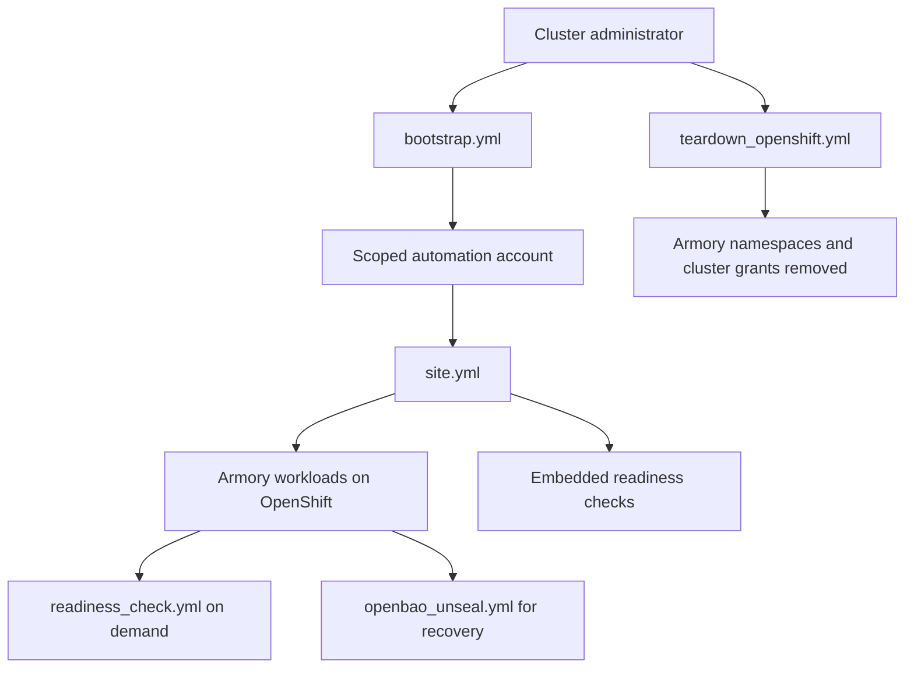
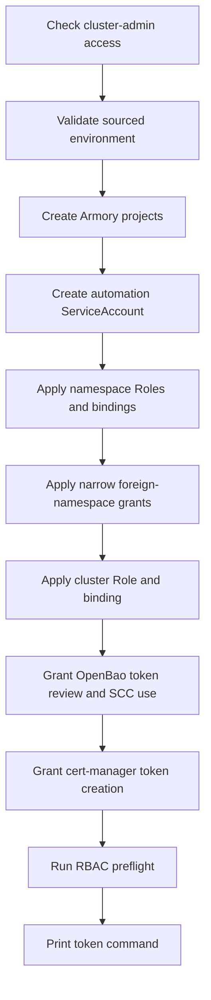
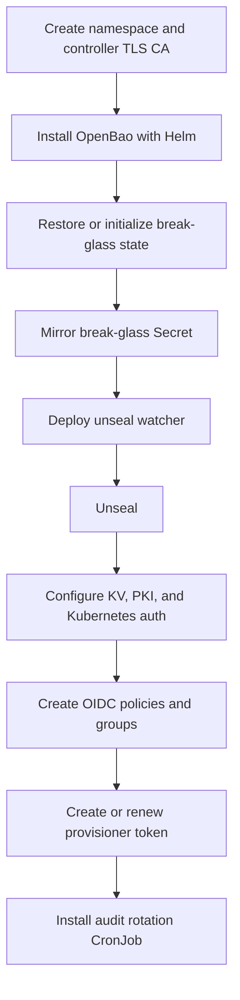
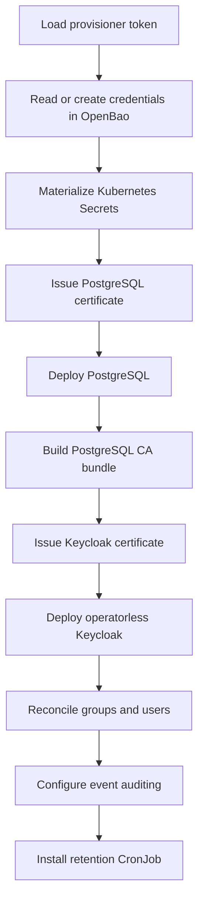
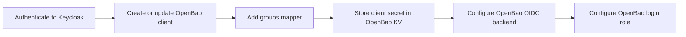
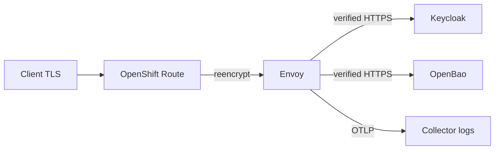
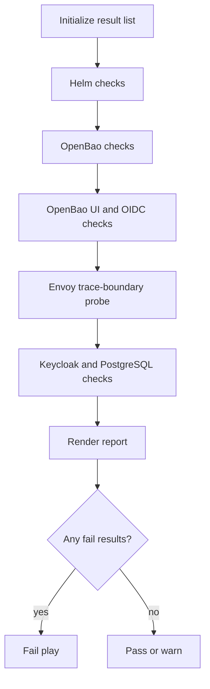
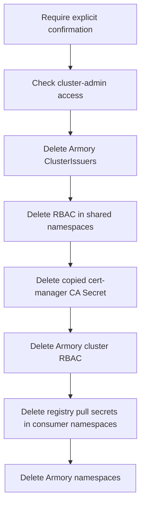
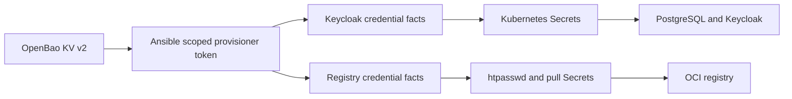

# Project Armory Ansible walkthrough

This directory deploys Project Armory to OpenShift. The current inventory is
`inventories/openshift/hosts.yml`, and the deployment target is a shared,
multi-tenant OpenShift 4.20 cluster. Some role defaults, comments, and helper
paths came from the earlier k3s/local-VM deployment. This document distinguishes
the active OpenShift behavior from those leftovers.

The descriptions below follow the task files and templates that Ansible actually
executes. Role-level README files are useful background, but several still
describe older Gateway API, local-VM, or Fedora-only behavior and are not the
source of truth for this branch.

## Execution model

Ansible runs against one logical inventory host, `localhost`, using the local
Python interpreter. "Local" means the Ansible controller, not an OpenShift node.
The controller uses a kubeconfig and the `oc` CLI to reach the cluster.

Before running a playbook, source the repository environment:

```bash
set -a
source ~/project-armory/.env
set +a
cd "${ARMORY_ANSIBLE_ROOT}"
```

The environment supplies the inventory, role path, Ansible settings, and the
`ARMORY_ENV_SOURCED=armory2-env-loaded-v1` sentry checked by `env_guard`.
`KUBECONFIG` must identify the intended OpenShift cluster and user.

Install the required collections before the first run:

```bash
ansible-galaxy collection install -r requirements.yml
```

The declared collections are `kubernetes.core` and `ansible.posix`.

The controller must also provide:

- Python 3 at `/usr/bin/python3`.
- `oc`, `helm`, `ansible-vault`, OpenSSL, and password-hash support required by
  the registry role.
- Passwordless `sudo` for controller-side package, trust-store, and `/etc/hosts`
  changes.
- Network access to the OpenShift API, public Routes, chart repositories, and
  container registries.

The OpenShift inventory overrides the most important generic role defaults:

| Setting | Effective OpenShift value |
|---|---|
| Cluster CLI | `oc` |
| Cluster access | `armory_kubeconfig_path` from `KUBECONFIG` |
| Privileged tasks in `site.yml` | disabled |
| Existing shared component | cert-manager in `cert-manager` |
| OpenBao namespace | `tex26-vault` |
| Keycloak namespace | `tex26-oidc` |
| Envoy namespace | `tex26-gateway` |
| Registry namespace | `tex26-oci-registry` |
| Automation namespace/account | `tex26-automation` |
| Storage class | `ocs-storagecluster-ceph-rbd` |
| External entry points | OpenShift Routes under the cluster apps domain |
| Keycloak | enabled, operatorless, PostgreSQL TLS enabled |
| OpenBao UI and unseal watcher | enabled |
| Registry | enabled |

Variable precedence matters. Values in
`inventories/openshift/group_vars/all.yml` override role defaults, while
extra-vars override both. Environment lookups inside defaults remain important
where the inventory does not provide an explicit replacement. The migration
findings near the end of this document call out cases where that still produces
k3s-era values.

## Playbook relationships



The expected lifecycle is:

1. Run `bootstrap.yml` as a cluster administrator.
2. Mint a short-lived token for the scoped automation ServiceAccount.
3. Run `site.yml` with that scoped identity.
4. Use `readiness_check.yml` for later validation and
   `openbao_unseal.yml` for manual recovery.
5. Run `teardown_openshift.yml` as a cluster administrator only when the entire
   Armory footprint should be destroyed.

## `playbooks/bootstrap.yml`

Run this playbook as a cluster administrator:

```bash
ansible-playbook playbooks/bootstrap.yml
```

It is safe to re-run when the RBAC matrix changes. It does not deploy the Armory
workloads.



### Step-by-step

1. The play gathers controller facts. The OpenShift inventory uses those facts
   to derive controller-local paths such as `~/.armory/openbao`.

2. It sets `armory_privileged_tasks: true`. This makes privileged branches in
   shared roles run during bootstrap but remain skipped during `site.yml`.

3. It runs:

   ```bash
   oc auth can-i create clusterrolebindings
   ```

   The play fails before making changes unless the response starts with `yes`.
   This check is skipped in Ansible check mode.

4. The `env_guard` role reads `ARMORY_LOG_NOLOG`, then asserts that
   `ARMORY_ENV_SOURCED` exists and exactly equals
   `armory2-env-loaded-v1`. The role is tagged `always`, so tag-limited runs
   still execute it.

5. The `automation_rbac` role creates the managed namespaces:

   - `tex26-oidc`
   - `tex26-vault`
   - `tex26-gateway`
   - `tex26-oci-registry`
   - `tex26-automation`

   It applies the inventory's Armory ownership labels to each namespace.

6. It creates ServiceAccount `tex26-automation` in namespace
   `tex26-automation`.

7. In every managed namespace it creates a Role and RoleBinding named
   `tex26-automation`. The Role permits management of the objects used by this
   repository:

   - Secrets, ConfigMaps, Services, ServiceAccounts, PVCs, Pods, and Events.
   - Pod logs, status, exec, and port-forward.
   - ServiceAccount token requests.
   - Deployments, StatefulSets, ReplicaSets, CronJobs, and Jobs.
   - OpenShift Routes.
   - cert-manager Certificates, CertificateRequests, and Issuers.
   - Namespaced Roles and RoleBindings.

8. In the shared `cert-manager` namespace it creates a narrowly scoped Role and
   RoleBinding named `tex26-automation-ca-writer`. They allow the automation
   account to create and maintain Secrets there, which is needed to copy the
   OpenBao server CA for ClusterIssuer TLS verification.

9. In `kube-public` it creates
   `tex26-automation-root-ca-reader`, restricted to reading the
   `kube-root-ca.crt` ConfigMap.

10. It creates cluster-scoped Role `tex26-automation` and its
    ClusterRoleBinding. The cluster permissions cover:

    - Armory's ClusterIssuers.
    - Namespace creation and read access.
    - Update/patch of only the configured Armory namespace names.
    - Read-only access to StorageClasses, SCCs, and CRDs.

11. It binds the OpenBao ServiceAccount to the existing
    `system:auth-delegator` ClusterRole through ClusterRoleBinding
    `tex26-openbao-tokenreview`. This lets OpenBao validate Kubernetes
    identities. (A second, independent copy of this same binding used to
    live in `openbao/tasks/install.yml` too, gated so it could never actually
    run under the documented bootstrap/site.yml flow — removed as dead code.)

12. It creates a namespaced RoleBinding from the OpenBao ServiceAccount to the
    existing `system:openshift:scc:nonroot-v2` ClusterRole. The chart pins
    non-root UID 100 and fsGroup 1000, which OpenShift's default
    `restricted-v2` allocation would reject. `nonroot-v2` permits those
    non-root IDs without permitting root. (A second copy of this binding used
    to also live in `openbao/tasks/install.yml`, gated only on `openbao_scc_name`
    being set — true on every `site.yml` run — rather than on running with
    cluster-admin rights. It relied on this bootstrap-created object already
    existing rather than being able to create it itself; removed.)

13. It does **not** create a `cert-manager-tokenrequest` Role/RoleBinding —
    that was removed after live-cluster inspection showed cert-manager's own
    install already ships that exact grant natively (Helm-labeled,
    `app.kubernetes.io/name: cert-manager`). Armory's previous copy under the
    same name briefly deleted the live, cert-manager-owned object on every
    bootstrap/teardown cycle before cert-manager's own controller reconciled
    it back.

14. The post-task includes `automation_rbac/tasks/preflight.yml`. That helper
    expands the RBAC rule matrices into namespaced, cluster-scoped, and
    foreign-namespace checks, runs `oc auth can-i`, collects negative results,
    and fails with the exact missing entries.

15. On success, the play prints the next command:

    ```bash
    scripts/use-automation-sa.sh
    ```

    The script uses `oc create token tex26-automation -n tex26-automation
    --duration=4h` to obtain a short-lived credential for `site.yml`.

Check mode performs the administrator confirmation and environment validation,
but nearly all bootstrap mutations and the RBAC preflight are explicitly
skipped.

## `playbooks/site.yml`

Run the deployment with the scoped automation identity:

```bash
ansible-playbook playbooks/site.yml
```

The play gathers controller facts and executes roles in dependency order.


### 1. Automation RBAC preflight

Because the OpenShift inventory sets `armory_privileged_tasks: false`, the
pre-task includes the same `automation_rbac` preflight used by bootstrap. Its
intent is to stop before deployment if the ServiceAccount no longer has a
required grant.

This task is tagged `always` and `rbac_preflight`, and is skipped in check mode.

### 2. Environment guard

`env_guard` validates that `.env` was sourced and resolves the sensitive-output
flag. `ARMORY_LOG_NOLOG=false` keeps credentials and tokens redacted. Setting it
to `true` exposes secrets in console and Ansible log output and should only be
used temporarily.

### 3. Helm controller tooling

The `helm` role:

1. Checks whether `helm` is already available.
2. Installs the Fedora `helm` package with `dnf` only when it is missing.
3. Runs `helm version --short`.
4. Runs `helm plugin list`.
5. Installs `helm-diff` from its GitHub repository if a plugin named `diff` is
   not listed.

The diff plugin supports the `kubernetes.core.helm` workflow used later.

### 4. OpenBao

OpenBao is the first cluster workload because cert-manager, Keycloak, OIDC, and
the registry depend on its secrets and PKI services.



#### 4.1 Role setup and TLS invariant

The role creates the controller-local work directory, which the OpenShift
inventory places at `~/.armory/openbao`. It first asserts that OpenBao TLS is
enabled; plaintext listener mode is unsupported.

#### 4.2 Namespace and bootstrap server certificate

`install.yml` performs these controller and cluster steps:

1. Ensures namespace `tex26-vault` exists.
2. Creates a root-only TLS artifact directory below the OpenBao work directory.
3. Installs OpenSSL with `dnf` on the controller.
4. Renders an OpenSSL configuration containing the inventory-provided Service
   DNS names plus `localhost` and `127.0.0.1` for the controller tunnel.
5. Checks for the locally generated CA, CA key, server certificate, and server
   key, and checks whether the CA expires within 30 days.
6. If any artifact is missing or the CA is near expiry, generates a 4096-bit
   self-signed server CA, a 4096-bit server key and CSR, signs the server
   certificate, and removes the CSR.
7. Installs this server CA into the controller's Fedora/RHEL trust store at
   `/etc/pki/ca-trust/source/anchors/openbao-ca.crt`, then runs
   `update-ca-trust` when the file changed.
8. Reads the root-owned certificate files and applies:

   - TLS Secret `openbao-server-tls`.
   - CA Secret `openbao-ca`.

   These are in `tex26-vault`. This bootstrap server CA is distinct from the PKI
   hierarchy that OpenBao creates after it is initialized.

#### 4.3 Helm installation

The role renders `~/.armory/openbao/values.yaml` and applies the upstream
OpenBao Helm chart with `kubernetes.core.helm`.

The rendered chart values configure:

- One standalone OpenBao server using file storage.
- A ClusterIP Service on port 8200.
- A data PVC and a separate audit PVC, both using the OpenShift inventory's ODF
  storage class.
- TLS-only server and cluster listeners using `openbao-server-tls`.
- `disable_mlock=true`, avoiding the `IPC_LOCK` capability on OpenShift nodes
  where swap is disabled.
- The OpenBao UI.
- A declarative file audit device at `/openbao/audit/audit.log`.
- A chart-created `openbao` ServiceAccount.
- No injector.

The scoped `site.yml` run skips the SCC binding and token-review
ClusterRoleBinding because bootstrap already created them. A privileged run
would reconcile those grants here too.

The role then creates an off-cluster access path:

1. Reads the OpenBao Service port.
2. Adds
   `127.0.0.1 openbao.tex26-vault.svc.cluster.local` to the controller's
   `/etc/hosts`.
3. Kills a stale matching port-forward.
4. starts `oc port-forward` from loopback port 8200 to the Service.
5. Waits until the local port accepts connections.

If the generated TLS Secret changed, the role deletes the OpenBao pod so the
StatefulSet recreates it with the new certificate. It then waits for an OpenBao
pod, waits for phase `Running`, and polls `/v1/sys/seal-status`.

#### 4.4 Break-glass restore and first initialization

With the OpenShift inventory, break-glass mirroring is enabled.

Before initialization, `break_glass_restore.yml` checks for the local vault
password file. If that file is missing, it reads Secret
`openbao-break-glass` from `tex26-vault` and restores both:

- `.vault-pass`
- the Ansible-Vault-encrypted `init-keys.yml`

It never overwrites an existing local password file. If neither local state nor
the Secret exists, it prints a warning; an already initialized and sealed
OpenBao cannot be recovered without those keys.

`init.yml` then:

1. Reads seal status and determines whether OpenBao is initialized.
2. On first initialization only, generates a 48-character vault password and
   stores it mode `0400`.
3. Calls `/v1/sys/init` with five key shares and a threshold of three.
4. Captures the base64 unseal shards and root token.
5. Writes them to a temporary plaintext YAML file.
6. Encrypts the YAML with `ansible-vault`.
7. Deletes the plaintext file.
8. Immediately submits the first three shards to unseal the new instance.

No credentials are regenerated when OpenBao reports that it is already
initialized.

#### 4.5 Break-glass mirror and automatic unseal watcher

`break_glass_mirror.yml` reads the local vault password and encrypted key file.
Because the watcher is enabled, it also decrypts the key file long enough to
extract the bare unseal shards. It writes Secret `openbao-break-glass` containing
the password, encrypted key document, and `unseal-keys.json`.

This is root-equivalent material. Anyone who can read Secrets in
`tex26-vault` can recover the root token and unseal OpenBao. The design chooses
recoverability and automatic restart recovery over keeping all unseal material
off-cluster.

`unseal_watcher.yml` applies:

- A ServiceAccount with no Kubernetes API permissions.
- A ConfigMap containing a small Python polling script.
- A Deployment that mounts only `unseal-keys.json` and `openbao-ca`.

Every 15 seconds the watcher verifies OpenBao's server certificate, reads seal
status, and submits up to three shards when sealed. A script hash in the pod
template rolls the Deployment when the script changes.

#### 4.6 Per-run unseal

`unseal.yml` also runs on every full OpenBao role execution:

1. Reads seal status.
2. If sealed and keys are not already facts, decrypts `init-keys.yml`.
3. Loads the unseal shards and root token.
4. Submits the threshold number of shards.
5. If OpenBao was already unsealed, decrypts the file only when needed to load
   the root token for later configuration.

The watcher and this task are deliberately redundant: the watcher handles
cluster reschedules, while the playbook guarantees that configuration has an
unsealed API and root bootstrap credential.

#### 4.7 KV, PKI, and Kubernetes auth configuration

`configure.yml` uses the root token and performs the following idempotent
bootstrap:

1. Reads current secret and auth mounts.
2. Enables KV v2 at `secret/` when missing.
3. Checks `secret/metadata/openbao/init` and, on first creation, stores the
   unseal keys and root token at `secret/data/openbao/init` for audited
   retrieval.
4. Enables three PKI mounts:

   - `pki-root` for the root CA.
   - `pki-int` for the internal issuing CA.
   - `pki-ext` for the external issuing CA.

5. Generates a 4096-bit, approximately ten-year Armory root CA if one does not
   exist.
6. For each missing intermediate, generates a 4096-bit CSR, signs it with the
   root, and imports the signed certificate into the intermediate mount.
7. Configures each intermediate's issuing-certificate and CRL URLs.
8. Creates the internal and external certificate roles. They allow configured
   bare domains, subdomains, and IP SANs, disallow localhost, do not require a
   common name, and issue 2048-bit RSA leaf certificates for up to one year.
9. Enables Kubernetes auth when missing.
10. Reads `kube-root-ca.crt` from `kube-public`.
11. Mints a long-lived token for the OpenBao ServiceAccount.
12. Configures Kubernetes auth to use the in-cluster Kubernetes API, cluster CA,
    and reviewer token.
13. Writes the `cert-manager` OpenBao policy, allowing signing and issuance from
    both intermediate roles.
14. Creates the OpenBao Kubernetes auth role `cert-manager`, bound to the
    cert-manager ServiceAccount in namespace `cert-manager`, with a one-hour
    token TTL.

#### 4.8 OpenBao UI identity scaffold

`oidc_scaffold.yml` prepares the OpenBao side before Keycloak client wiring:

1. Enables the `oidc/` auth mount if missing.
2. Writes three ACL policies:

   - `armory-ui-admin`: read/list secrets plus selected system metadata.
   - `armory-ui-operator`: read/list KV data and metadata.
   - `armory-ui-viewer`: read/list KV metadata only.

3. Upserts external OpenBao identity groups for `armory-admins`,
   `armory-operators`, and `armory-viewers`.
4. Reads the OIDC mount accessor.
5. Enumerates existing group aliases for that mount.
6. Creates missing aliases connecting the Keycloak group names to their
   canonical OpenBao identity groups.

The actual OIDC discovery URL and client secret are configured later by the
`openbao_oidc` role, after Keycloak exists.

#### 4.9 Scoped Ansible provisioner token

`provisioner_token.yml` keeps routine automation off the root token:

1. Writes policy `ansible-provisioner`. It grants configured KV prefix access,
   external CA PEM read access, audit-device read access, and token self-lookup
   and renewal.
2. Checks for the vaulted controller-local token file.
3. Decrypts and validates an existing token with `lookup-self`.
4. Confirms the expected policy is attached.
5. If missing or invalid, mints a no-parent periodic token, writes it to a
   temporary YAML file, encrypts it with Ansible Vault, and removes the
   plaintext file.
6. If valid, renews the existing token.

Downstream roles load this token from the encrypted file and use it for
application-owned KV operations.

#### 4.10 Audit rotation

When file auditing and rotation are enabled, `audit_rotate.yml` applies:

- A dedicated ServiceAccount.
- A namespaced Role and RoleBinding permitting pod lookup and `pods/exec`.
- A ConfigMap containing the rotation script.
- CronJob `openbao-audit-rotate`, scheduled daily at `02:17`.

The job renames the active audit file, finds the `bao` process and sends SIGHUP
so the audit device reopens the configured path, then retains the seven newest
rotated files.

### 5. cert-manager integration

This branch does not install cert-manager. It reuses the cluster's shared
OpenShift cert-manager installation.

The role no longer manages any TokenRequest RBAC for cert-manager — see the
note under bootstrap item 13 above. What it actually does:

1. Copies Secret `openbao-ca` from `tex26-vault` to the shared
   `cert-manager` namespace. This CA verifies the HTTPS connection from
   cert-manager to the OpenBao server.
2. Renders and applies two ClusterIssuers:

   - `tex26-openbao-pki-internal`, signing through
     `pki-int/sign/armory-internal`.
   - `tex26-openbao-pki-external`, signing through the configured external PKI
     role.

4. Each ClusterIssuer points to the internal OpenBao HTTPS Service, pins the
   server name, reads its CA from the copied Secret, and authenticates through
   OpenBao's Kubernetes auth with the cert-manager ServiceAccount.
5. The role waits up to 180 seconds for each ClusterIssuer to report `Ready`.

### 6. Keycloak and PostgreSQL

The OpenShift inventory enables Keycloak and PostgreSQL TLS. The role is skipped
entirely when `keycloak_enabled` is false and skipped in check mode.



#### 6.1 Credentials and Secrets

The role ensures namespace `tex26-oidc`, decrypts the scoped OpenBao
provisioner token, and reads three KV entries:

| Purpose | OpenBao KV path | Kubernetes Secret |
|---|---|---|
| PostgreSQL login | `secret/keycloak/db` | `keycloak-db-secret` |
| Armory realm admin | `secret/keycloak/realm-admin` | `keycloak-realm-admin` |
| Keycloak master bootstrap admin | `secret/keycloak/bootstrap-admin` | `keycloak-bootstrap-admin` |

When a value is missing, the role generates it once and stores it in OpenBao.
On later runs it reuses the existing value. It then directly applies the three
Kubernetes Secrets. There is no Vault Secrets Operator or continuous
synchronization loop on this branch.

It also copies `openbao-ca` into `tex26-oidc` for controller and workload trust
operations.

#### 6.2 PostgreSQL

The common certificate helper creates Certificate `keycloak-postgres-tls` using
the internal ClusterIssuer and waits for `Ready`. The certificate DNS SAN is
`postgres.tex26-oidc.svc.cluster.local`.

The PostgreSQL template applies:

- ClusterIP Service `postgres`.
- A TLS configuration ConfigMap.
- A one-replica StatefulSet using the OpenShift-friendly
  `quay.io/sclorg/postgresql-16-c9s` image.
- An 8 GiB ReadWriteOnce PVC using ODF Ceph RBD.

The image accepts OpenShift's arbitrary namespace UID, so the pod intentionally
does not pin `runAsUser` or `fsGroup`. The certificate Secret is mounted mode
`0640`, which is readable through OpenShift's group 0 convention and acceptable
to PostgreSQL's private-key checks. The role waits for the StatefulSet rollout.

For Keycloak's `verify-full` database connection, the common HTTPS helper:

1. Port-forwards the PostgreSQL Service to the same controller port.
2. maps its Service FQDN to `127.0.0.1`.
3. writes the bootstrap OpenBao server CA from `openbao-ca`.
4. fetches the `pki-int` CA from OpenBao.
5. combines both certificates into a temporary bundle.

The role stores that bundle in ConfigMap `keycloak-postgres-ca`, removes the
temporary file and hosts entry, and later mounts the ConfigMap into Keycloak.

#### 6.3 Keycloak server

The common certificate helper creates `keycloak-internal-tls` for
`keycloak-service.tex26-oidc.svc.cluster.local`.

The operatorless deployment path:

1. Renders the `armory` realm definition. The initial import enables the realm,
   TLS for external clients, event logging, the three groups, and the `admin`
   realm user.
2. Stores that JSON in Secret `keycloak-realm-import` because it contains the
   realm admin password.
3. Applies ClusterIP Service `keycloak-service` on HTTPS port 8443.
4. Applies a one-replica Keycloak Deployment.
5. Starts Keycloak with `--import-realm`.
6. Configures PostgreSQL through `KC_DB_URL` with `sslmode=verify-full`, the
   PostgreSQL Service FQDN, and the mounted CA bundle.
7. Injects the database and bootstrap-admin credentials from Secrets.
8. Disables HTTP and serves HTTPS with `keycloak-internal-tls`.
9. Sets the public OpenShift Route URL as `KC_HOSTNAME` and trusts forwarded
   proxy headers.
10. Enables HTTPS health probes on management port 9000 and event log levels.
11. Waits for the Deployment rollout before making admin API calls.

No Keycloak Operator, Keycloak CRDs, Gateway, or HTTPRoute is created on this
branch. Public exposure is added later by the Envoy role.

#### 6.4 Realm groups and users

For each Keycloak admin REST phase, the controller:

1. Port-forwards the internal Keycloak HTTPS Service.
2. Keeps the Service FQDN in the URL and maps it to loopback so the certificate
   SAN remains valid.
3. Builds a trust bundle containing the OpenBao server CA and internal PKI CA.
4. Reads the master bootstrap credentials from the Kubernetes Secret.
5. Obtains a short-lived `admin-cli` token from the master realm.

The group phase POSTs the three configured groups, accepting either `201`
created or `409` already exists.

The user phase lists the groups and builds a name-to-ID map. For each configured
user (`admin`, `operator`, and `viewer`) it:

1. Refreshes the short-lived master admin token.
2. Asserts that every requested group exists.
3. Reads the user's password from its OpenBao path or generates one.
4. Stores the username and password in OpenBao.
5. Looks up the exact username in Keycloak.
6. Creates a missing enabled user with a non-temporary password.
7. Re-reads and asserts the user exists.
8. Reconciles enabled state, verified email, email address, and names.
9. Adds all configured group memberships.

Existing Keycloak user passwords are not reset by this reconciliation. If a
user's OpenBao entry is lost and regenerated while the Keycloak user remains,
the two values drift until the user is deleted or its password is manually reset.

#### 6.5 Realm events and retention

The event phase reads the current realm event configuration and updates it only
when managed fields differ. The desired state enables user and admin events,
retains user events for 90 days, records admin representations, and sends events
to `jboss-logging`.

Because Keycloak does not expire admin events itself, the role applies a weekly
CronJob scheduled at `03:23` Sunday. Its dedicated namespaced ServiceAccount may
list and exec into Pods. The script execs into PostgreSQL and deletes
`admin_event_entity` rows older than 90 days.

### 7. OpenBao OIDC integration

This role runs only when both Keycloak and the OpenBao UI are enabled.



The role:

1. Port-forwards the Keycloak HTTPS Service and builds the combined internal
   trust bundle.
2. Reads the Keycloak bootstrap-admin username and password from its Secret.
3. Obtains a master-realm admin token.
4. Looks up client `openbao` in realm `armory`.
5. On first creation, generates a client secret unless one was explicitly
   provided and creates a confidential authorization-code client.
6. Sets the OpenBao public Route as the client's root/admin URL and configures
   the two OpenBao callback URLs and web origin.
7. Re-reads and updates the client representation on every reconciliation.
8. Adds a `groups` OIDC protocol mapper when missing.
9. Rotates the Keycloak client secret only when
   `openbao_oidc_client_secret` is explicitly supplied.
10. Reads the effective secret back from Keycloak.
11. Loads the scoped OpenBao provisioner token and stores client ID, client
    secret, and issuer URL at `secret/openbao/ui-oidc`.
12. Loads the OpenBao root token for auth-backend configuration.
13. Reads the external OpenBao PKI CA PEM.
14. Configures the OpenBao `oidc` auth backend with the Keycloak public realm
    discovery URL, client credentials, discovery CA, and default role
    `armory-ui`.
15. Configures the login role to use `preferred_username`, the `groups` claim,
    the allowed callbacks, `openid profile email` scopes, and the baseline
    `default` policy.
16. Removes the temporary CA file and Keycloak hosts entry.

The earlier OpenBao scaffold maps group claims to the three OpenBao policy
tiers after login.

### 8. Envoy OpenShift edge

Envoy remains in front of Keycloak and OpenBao because OpenShift's HAProxy router
does not create a new W3C trace boundary.



The role:

1. Fails if `envoy_proxy_upstreams` is empty.
2. Ensures namespace `tex26-gateway`.
3. copies `openbao-ca` into that namespace.
4. Creates and waits for the Envoy serving Certificate. Its SANs include the
   Envoy Service names and the exposed Keycloak/OpenBao hostnames.
5. Applies a small OpenTelemetry Collector ConfigMap, Service, and Deployment.
   It accepts OTLP gRPC and writes detailed spans to its pod log.
6. Renders the Envoy ConfigMap and hashes the configuration into the Deployment
   pod template so changes cause a rollout.
7. Applies the Envoy ServiceAccount, ClusterIP Service, and two-replica
   Deployment on port 8443.
8. Waits for the Deployment rollout.
9. Reads `ca.crt` from the Envoy TLS Secret and uses it as each Route's
   `destinationCACertificate`.
10. Applies one re-encrypt OpenShift Route for Keycloak and one for OpenBao.
    The trace-probe virtual host is configured but has `expose: false`, so no
    Route publishes it.

For each request, Envoy's early header mutation copies the inbound
`traceparent` to `x-external-traceparent`, removes configured trace headers
before the tracing decision, and starts a new sampled edge trace. It routes by
hostname and validates each TLS upstream against a pinned Service DNS SAN.

The OpenShift router supplies the public wildcard certificate. It re-encrypts
to Envoy and verifies Envoy with the embedded destination CA, so neither hop is
plaintext.

### 9. OCI registry

The registry is enabled by the OpenShift inventory. It is intentionally routed
directly through the OpenShift router rather than through Envoy because image
pulls are node/CRI-O traffic, not user requests whose trace context needs an
attribution boundary.

The role:

1. Ensures namespace `tex26-oci-registry`.
2. Loads the scoped OpenBao provisioner token.
3. Reads `secret/registry/credentials`.
4. Reuses the existing password or generates a 32-character password once.
5. Stores the credentials in OpenBao on first creation.
6. Creates a bcrypt `htpasswd` Secret. Authentication is mandatory by default.
7. Creates and waits for Certificate `registry-tls`, issued by the internal
   ClusterIssuer for the registry Service DNS names.
8. Applies:

   - A ServiceAccount.
   - A 20 GiB ReadWriteOnce ODF PVC.
   - A ClusterIP Service on port 5000.
   - A one-replica `registry:2` Deployment.

9. Uses Deployment strategy `Recreate` because the single RWO PVC cannot be
   mounted by old and new replicas simultaneously.
10. Enables HTTPS and htpasswd authentication in the registry container.
11. Uses TCP health probes because an authenticated `/v2/` correctly returns
    `401`, which would fail an HTTP probe.
12. Waits for rollout.
13. Reads the registry certificate's `ca.crt`.
14. Creates a re-encrypt OpenShift Route with a 300-second HAProxy timeout. The
    router's public wildcard certificate is already trusted by RHCOS/CRI-O, and
    the router verifies the registry backend with the embedded CA.
15. Creates `kubernetes.io/dockerconfigjson` pull Secrets in every namespace
    listed in `registry_pull_secret_namespaces`. The current OpenShift inventory
    leaves that list empty.

### 10. Embedded readiness validation

The `readiness_check` role runs last unless Ansible is in check mode. Its exact
checks are described in the standalone playbook section below.

### 11. Controller cleanup

The final post-task always includes
`common/tasks/stop_port_forwards.yml`. It:

1. Kills controller processes matching
   `port-forward --address 127.0.0.1`.
2. Removes loopback `/etc/hosts` entries for `*.svc.cluster.local`.

Cleanup is best-effort. This prevents a later run from silently talking through
a stale tunnel to a replaced Pod.

## `playbooks/readiness_check.yml`

Run the readiness role without a full deployment:

```bash
ansible-playbook playbooks/readiness_check.yml
```

The play runs `env_guard`, then `readiness_check`. It does not gather facts and
skips the readiness role in check mode.



Every check appends a result with component, name, status, detail, and error.
The report groups results by component and counts `pass`, `warn`, and `fail`.
Warnings do not fail the play. Failures do when
`readiness_check_fail_on_issues=true`, which is the default.

### Helm checks

1. Runs `helm version --short` and records CLI availability.
2. Runs `helm repo list` when Helm returned success.
3. Treats an empty persistent repository list as valid because charts use
   inline repositories or OCI references.

### OpenBao checks

1. Resolves the address from `OPENBAO_ADDR` or
   `readiness_check_openbao_addr`.
2. Fails if the configured scheme is not HTTPS.
3. Checks that the parsed host and port accept TCP connections.
4. Calls `/v1/sys/health` with certificate validation enabled.
5. Calls the same endpoint over plaintext HTTP and fails if OpenBao responds as
   a usable API.
6. Records health response status.
7. Reads the `sealed` field and fails if OpenBao is sealed.
8. Loads the vaulted provisioner token.
9. Calls `lookup-self` and confirms policy `ansible-provisioner` is attached.
10. When auditing is enabled, lists audit devices and confirms `file/` exists.
    If auditing is disabled by configuration, the result is a warning.

### OpenBao UI and OIDC checks

These run because the OpenShift inventory enables the OpenBao UI:

1. Probes the public OpenBao HTTPS URL, accepting normal UI, redirect, auth, and
   forbidden responses.
2. If DNS resolution fails, attempts a direct ingress-IP fallback with a Host
   header.
3. Loads the root token.
4. Confirms the `oidc/` auth mount.
5. Confirms the auth config contains a client ID.
6. Confirms all three UI ACL policies exist.
7. Confirms all three external identity groups exist.
8. Lists group aliases and confirms all three Keycloak group names are present.

### Envoy trace-boundary check

The trace test creates temporary resources in `tex26-gateway`:

1. Applies a one-replica header-echo Deployment and ClusterIP Service.
2. Waits for rollout.
3. Port-forwards the Envoy Service to controller loopback.
4. Maps the private trace-probe hostname to loopback.
5. Sends a forged `traceparent`, `tracestate`, and `baggage` header through
   Envoy.
6. Reads the headers received by the echo backend.
7. Fails unless the attacker trace ID, tracestate, and baggage are absent.
8. Fails unless the backend receives a well-formed, newly minted traceparent
   with a different trace ID.
9. Warns unless the original traceparent appears in the forensic header.
10. Removes the hosts entry, Service, and Deployment.

The request disables certificate validation because the temporary hostname is
not a SAN on Envoy's serving certificate. This check tests trace handling, not
edge TLS.

### Keycloak and PostgreSQL checks

1. Confirms the Keycloak namespace.
2. Confirms Service `keycloak-service`.
3. Checks for Secret `keycloak-bootstrap-admin`; absence is a warning.
4. Probes the public realm discovery endpoint, with an ingress fallback on DNS
   failure.
5. Builds the internal Keycloak trust bundle and port-forward.
6. Reads the bootstrap admin Secret and obtains a master admin token.
7. Confirms `admin`, `operator`, and `viewer` exist.
8. Confirms each user has its configured realm group.
9. Calls the internal discovery endpoint with strict certificate validation.
10. Reads `KC_DB_URL` from the Keycloak Deployment.
11. Confirms it contains `sslmode=verify-full`.
12. Confirms it uses the PostgreSQL Service FQDN present in the certificate SAN.
13. Execs `SHOW ssl;` in PostgreSQL and requires the result `on`.

### Report and cleanup behavior

The role renders and prints a text report, then fails once at the end if any
critical result failed. This lets one run expose multiple problems.

Unlike `site.yml`, this standalone playbook has no post-task that includes
`stop_port_forwards.yml`. The OpenShift migration findings below explain the
resulting standalone-run limitations.

## `playbooks/openbao_unseal.yml`

The intended recovery command is:

```bash
ansible-playbook playbooks/openbao_unseal.yml
```

The play does not gather facts. It:

1. Runs `env_guard`.
2. Includes only `openbao/tasks/unseal.yml`.
3. Reads OpenBao seal status.
4. If sealed, decrypts the local vaulted init keys, loads the root token, and
   submits the configured threshold of shards.
5. If already unsealed, loads the root token only when it is not already a fact.

It does not install or configure OpenBao, restore break-glass files from the
cluster, start the controller-to-Service port-forward, add the internal FQDN to
`/etc/hosts`, or deploy the unseal watcher. On the off-cluster OpenShift
controller, those omissions are important and are listed in the migration
findings.

## `playbooks/teardown_openshift.yml`

This playbook is destructive. Deleting `tex26-vault` removes the OpenBao data
PVC, PKI, KV data, audit data, and the in-cluster break-glass Secret.

Run it as a cluster administrator only:

```bash
ansible-playbook playbooks/teardown_openshift.yml -e teardown_confirm=true
```



### Step-by-step

1. Requires the boolean extra-var `teardown_confirm=true`.
2. checks `oc auth can-i create clusterrolebindings` and fails unless the
   current identity is a cluster administrator. The assertion is skipped in
   check mode.
3. Deletes ClusterIssuers:

   - `tex26-openbao-pki-internal`
   - `tex26-openbao-pki-external`

4. Deletes namespaced RoleBindings and Roles in shared namespaces:

   - Automation CA-writer access in `cert-manager`.
   - Automation root-CA reader access in `kube-public`.

   It does **not** touch `cert-manager-tokenrequest` — that object belongs to
   cert-manager's own install (confirmed via its Helm labels), not armory;
   an earlier version of this playbook deleted it here, which briefly took
   out a live object the shared cert-manager controller depends on.

5. Deletes copied Secret `openbao-ca` from `cert-manager`.
6. Deletes ClusterRoleBinding `tex26-openbao-tokenreview`.
7. Deletes the automation ClusterRoleBinding and ClusterRole.
8. Deletes the registry pull Secret (`registry_pull_secret_name`, default
   `armory-registry-pull`) from every namespace listed in
   `registry_pull_secret_namespaces` that is not one of the 5 armory
   namespaces. Those consumer namespaces are not armory-owned and are never
   deleted by this playbook, so the secret would otherwise be orphaned.
9. Deletes, waits for, and deduplicates this namespace list:

   - `tex26-oidc`
   - `tex26-vault`
   - `tex26-gateway`
   - `tex26-oci-registry`
   - `tex26-automation`

The play intentionally does not uninstall or modify the shared cert-manager
operator, and it does not remove controller-local OpenBao break-glass keys
under `~/.armory/openbao` (they are the only way to recover an OpenBao
instance that outlives this run).

After the cluster deletions, a `post_tasks` block undoes the remaining
controller-local side effects:

10. Removes `/etc/pki/ca-trust/source/anchors/openbao-ca.crt` and re-runs
    `update-ca-trust` if it was present, undoing the trust-anchor install from
    `openbao/tasks/install.yml`.
11. Runs the same `common/tasks/stop_port_forwards.yml` cleanup used by
    `site.yml`'s post-task, killing any leftover `port-forward` processes and
    removing loopback `/etc/hosts` aliases for `*.svc.cluster.local`.
12. Uninstalls the `helm-diff` plugin if present.

It deliberately leaves the `helm` package itself installed: the `helm` role
only installs it when missing, so a controller may have had it before this
project ever ran, and removing a system package teardown didn't necessarily
install is out of scope.

In check mode, explicit confirmation is still required, while the administrator
assertion and all deletions are skipped.

## Generated resource summary

| Scope | Important generated objects |
|---|---|
| Cluster | Automation ClusterRole/Binding, `tex26-openbao-tokenreview`, two ClusterIssuers |
| `cert-manager` | CA copy, automation CA-writer RBAC |
| `kube-public` | Narrow automation reader Role/Binding |
| `tex26-vault` | OpenBao Helm release, data/audit PVCs, TLS/CA/break-glass Secrets, watcher, audit CronJob |
| `tex26-oidc` | PostgreSQL StatefulSet/PVC, Keycloak Deployment, Services, Certificates, credential/import Secrets, admin-event CronJob |
| `tex26-gateway` | Envoy, OTel collector, Keycloak/OpenBao Routes, trace-probe resources during readiness |
| `tex26-oci-registry` | Registry Deployment/PVC/Service, auth and TLS Secrets, public Route |
| `tex26-automation` | Scoped automation ServiceAccount |

## Credential and trust flows



Generated application passwords are read from OpenBao before generation.
OpenBao remains the source of truth, while Ansible materializes the Kubernetes
Secrets required by workloads. Re-running a role is the synchronization
mechanism; no in-cluster secret operator watches these paths.

There are three distinct certificate trust domains in the current design:

1. The controller-generated OpenBao **server CA**, stored in `openbao-ca`, signs
   the OpenBao HTTPS listener.
2. The OpenBao **PKI root and intermediate CAs** sign cert-manager workload
   Certificates such as Keycloak, PostgreSQL, Envoy, and registry TLS.
3. The OpenShift router's **public wildcard certificate chain** signs the
   external Route endpoints.

They are not interchangeable. Several migration findings below result from
treating one as if it covered another.

## Tags and check mode

Common targeted runs include:

```bash
ansible-playbook playbooks/site.yml --tags openbao
ansible-playbook playbooks/site.yml --tags keycloak_install
ansible-playbook playbooks/site.yml --tags openbao_oidc
ansible-playbook playbooks/site.yml --tags envoy_proxy
ansible-playbook playbooks/site.yml --tags registry
ansible-playbook playbooks/site.yml --tags readiness_check
```

Important tag behavior:

- `env_guard` and the RBAC preflight use `always`.
- The `openbao_oidc` role carries `openbao`, `keycloak`, and `openbao_oidc`, so a
  broad OpenBao or Keycloak tag can select it.
- OpenBao has phase tags such as `openbao_install`, `openbao_init`,
  `openbao_unseal`, `openbao_configure`, and `openbao_provisioner`.
- The common port-forward cleanup is tagged `always`.

Check mode is not a complete simulation. Most cluster/API mutations explicitly
skip themselves, readiness is omitted, and some controller-side modules still
evaluate or report predicted changes. Use syntax/list checks for static
validation and a real disposable deployment for behavioral validation.

## OpenShift migration findings to resolve

The following findings come from the active task and variable paths in this
branch. They are documented here so operators do not mistake intended behavior
for verified behavior. They should be addressed in implementation before this
workflow is treated as a reliable fresh deployment.

### Likely deployment blockers

1. **RESOLVED — the provisioner policy now grants the registry KV path.**

   `openbao_provisioner_kv_prefixes` in `roles/openbao/defaults/main.yml` lists
   `keycloak`, `openbao`, and `registry`. The scoped provisioner token can
   read/write `secret/data/registry/credentials` without a `403`.

2. **RESOLVED — Envoy now builds a combined trust bundle for its two upstreams.**

   `roles/envoy_proxy/tasks/main.yml` reads the bootstrap `openbao-ca` Secret
   and fetches the `pki-int` issuer CA (the one that actually signs Keycloak's
   internal certificate) from OpenBao, concatenates both PEMs, and applies the
   result as the `openbao-ca` Secret mounted into the edge namespace. Both
   upstreams validate correctly.

3. **RESOLVED — the readiness trace policy and Envoy strip list now agree.**

   `envoy_proxy_trace_strip_headers` in `roles/envoy_proxy/defaults/main.yml`
   includes `baggage` alongside `traceparent` and `tracestate`. The
   trace-boundary check's requirement that forged `baggage` never reach the
   backend matches the rendered Envoy configuration.

4. **RESOLVED — no OIDC discovery CA mismatch.**

   The `oidc_discovery_ca_pem` variable no longer exists. OpenBao's `oidc/`
   auth backend config (`roles/openbao_oidc/tasks/oidc_config.yml`) sets only
   `oidc_discovery_url`, `oidc_client_id`, `oidc_client_secret`, and
   `default_role` — no CA is pinned, so discovery against the public Keycloak
   Route validates against system trust, consistent with the router's publicly
   trusted wildcard chain.

### Standalone playbook problems

5. **RESOLVED — `openbao_unseal.yml` establishes off-cluster connectivity.**

   The play now runs `common/tasks/prepare_internal_https_caller_dns.yml`
   (maps the Service FQDN to loopback and starts the port-forward) and
   `openbao/tasks/break_glass_restore.yml` before `unseal.yml`, plus a
   `post_tasks` reap via `stop_port_forwards.yml`. It no longer depends on
   connectivity or local key state already existing.

6. **RESOLVED — standalone readiness prepares its OpenBao tunnel.**

   `check_openbao.yml` now runs the same `prepare_internal_https_caller_dns.yml`
   helper ("Make the OpenBao service reachable from the controller") before any
   OpenBao probe, with a comment noting it's a no-op when `site.yml` already
   opened the tunnel.

7. **RESOLVED — standalone readiness reaps port-forwards.**

   `playbooks/readiness_check.yml` has a `post_tasks` block that includes
   `stop_port_forwards.yml`, explicitly commented as covering the case where no
   other play in the run does this cleanup.

8. **RESOLVED in practice — common token-file fallbacks still say `/opt/openbao`
   in their default expression, but the fallback never triggers on this
   inventory.**

   `common/defaults/main.yml` still reads
   `openbao_work_dir | default('/opt/openbao')`, but `openbao_work_dir` is now
   set once in `inventories/openshift/group_vars/all.yml`
   (`~/.armory/openbao`) as a group var, not a role default. Ansible loads
   group vars for every play against this inventory regardless of which roles
   run, so the `/opt/openbao` fallback is currently dead code. No action
   required for this inventory; the literal could still be cleaned up for
   defensiveness against a future inventory that omits the group var.

### Public endpoint and readiness drift

9. **RESOLVED — `.env.example` k3s-era public values.**

    `.env.example` was removed from the repo entirely; `.env.example`
    is now the only template, and its `ARMORY_PUBLIC_DOMAIN` doubles as the
    source for `armory_apps_domain` (see finding 10), so there's no longer a
    second file that can drift out of sync with the OpenShift inventory.

10. **RESOLVED — the external PKI role and `armory_apps_domain` now share one
    source.**

    `armory_apps_domain` (`inventories/openshift/group_vars/all.yml`) reads
    `ARMORY_PUBLIC_DOMAIN` via the same `lookup('ansible.builtin.env', ...)`
    pattern already used by `openbao_pki_external_allowed_domains` and
    `openbao_pki_external_cert_role`. Setting `ARMORY_PUBLIC_DOMAIN` in `.env`
    now drives the apps domain, the derived Route hosts
    (`armory_keycloak_host`, `armory_openbao_host`, `armory_registry_host`),
    and the external PKI role/allowed-domains together — they can no longer
    disagree.

11. **RESOLVED — the ingress fallback goes through a real edge tunnel, not a
    hardcoded local-router assumption.**

    Readiness now includes `roles/readiness_check/tasks/ensure_edge_tunnel.yml`,
    which port-forwards to the edge Envoy Service (skipping if a tunnel from an
    earlier check is already open) before falling back. The Keycloak fallback
    aliases `readiness_check_keycloak_public_host` — the real
    `keycloak.<apps-domain>` hostname — not the bare apps domain.

12. **RESOLVED — external TLS verification is enabled by default.**

    `readiness_check_validate_tls` and `readiness_check_openbao_validate_tls`
    both default to `true` in `roles/readiness_check/defaults/main.yml`. Public
    Keycloak and OpenBao probes validate the router's publicly trusted wildcard
    chain.

### Validation and documentation gaps

13. **RESOLVED — the Helm readiness result no longer passes when Helm is
    missing.**

    `check_helm.yml` now passes only on return code `0` or `2`; a missing Helm
    (rc `127`) reports `fail` with detail "not installed".

14. **RESOLVED — the RBAC preflight's `--as` usage matches who is actually
    running it.**

    `roles/automation_rbac/tasks/preflight.yml` now omits `--as` when
    `armory_privileged_tasks` is false (the scoped `site.yml` run, where the
    active identity already IS the automation ServiceAccount), and only uses
    `--as` during the privileged `bootstrap.yml` run where impersonation is
    correct. The one-verb-per-rule sampling behavior is unchanged, but is now
    explicitly documented in a comment as an intentional tradeoff (RBAC grants
    a rule's verbs together, so one sample per rule adds signal without
    multiplying API calls), not an undocumented gap.

15. **RESOLVED — readiness has registry and ClusterIssuer health stages.**

    `roles/readiness_check/tasks/main.yml` now includes `check_registry.yml`
    (gated on `registry_enabled`) and `check_cert_manager.yml` (gated on
    `readiness_check_cert_manager_enabled`).

16. **MOSTLY RESOLVED — most dead/stale items are gone; one unused alias
    remained and has now been removed.**

    `keycloak_ingress_enabled`, `openbao_ingress_enabled`, `keycloak_work_dir`,
    the Keycloak role README's HTTPRoute/Gateway description, and the k3s
    containerd/Delve block in `.env.example` are all gone. The
    `keycloak_internal_http_url` backward-compatible alias in
    `roles/keycloak/defaults/main.yml` had no remaining consumers anywhere in
    the repo and has been removed. Not re-verified: the "unused readiness HTTP
    policy variables" sub-item. Left as-is (not stale, just accurate given the
    current setup): the `local Fedora VM` play names in `openbao_unseal.yml`
    and `readiness_check.yml`, and Fedora-listed Galaxy `meta/main.yml`
    platforms — the project still targets a Fedora workstation/VM as its
    controller.

17. **RESOLVED — seeded realm-user KV entries no longer gain a version on every
    run.**

    `realm_user_item.yml`'s credential-store task is now guarded with
    `when: (_keycloak_realm_user_creds_current.status | default(404)) != 200`,
    matching the first-write-only handling used for the DB, realm-admin,
    bootstrap-admin, and registry credentials. A comment cites this explicitly.

## Recommended validation order

After resolving the migration blockers, validate from inside the supported
controller environment:

```bash
ansible-playbook --syntax-check playbooks/bootstrap.yml
ansible-playbook --syntax-check playbooks/site.yml
ansible-playbook --syntax-check playbooks/readiness_check.yml
ansible-playbook --syntax-check playbooks/openbao_unseal.yml
ansible-playbook --syntax-check playbooks/teardown_openshift.yml
ansible-lint -c .ansible-lint playbooks/ roles/
yamllint -c .yamllint .
```

The behavioral acceptance path is:

1. Bootstrap as cluster-admin.
2. Deploy as the scoped account.
3. Deploy a second time and confirm idempotency.
4. Run standalone readiness and confirm it creates and cleans up its own access
   paths.
5. Restart the OpenBao pod and confirm the watcher unseals it.
6. Exercise public Keycloak, OpenBao, and registry Routes with certificate
   validation enabled.
7. Exercise an authenticated registry push and pull.
8. Confirm the trace probe strips all configured untrusted propagation headers
   and emits a new trace.
9. Teardown only in a disposable environment and confirm shared cert-manager is
   untouched.
