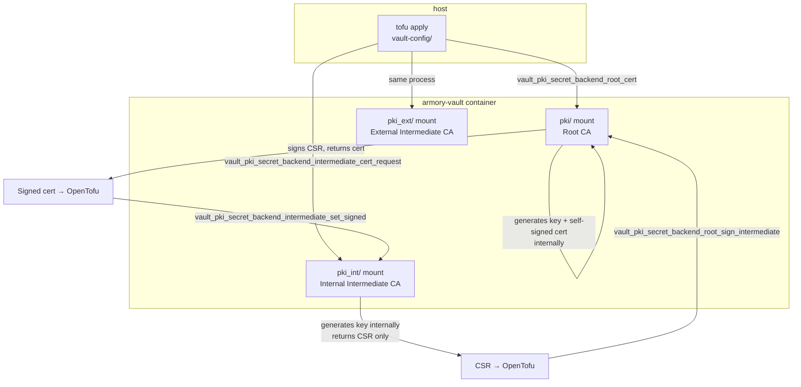
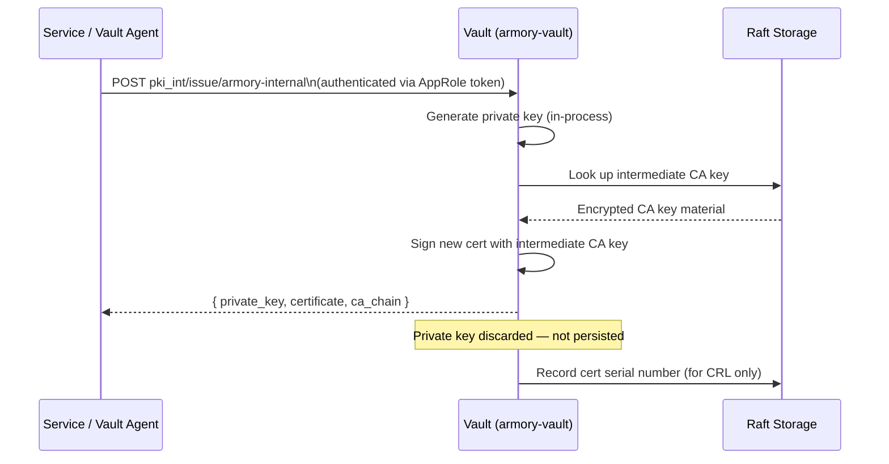
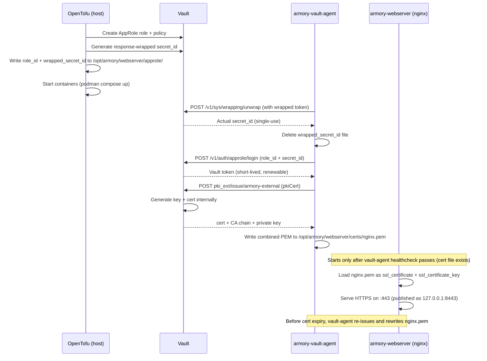

# PKI Workflows and Cryptographic Material

A reference for where every key and certificate originates, where it lives, and when it moves.

---

## 1. TLS Bootstrap (vault/ module)

Generated entirely on the **host** inside the `tofu` process — no containers involved.

```mermaid
flowchart TD
    A[tofu apply] -->|in-process, no network| B[tls_private_key.ca\nECDSA P-384]
    B --> C[tls_self_signed_cert.ca\nself-signed CA cert]
    B --> D[tls_private_key.server\nECDSA P-384]
    D --> E[tls_cert_request.server\nCSR]
    C --> F[tls_locally_signed_cert.server\nsigned by CA key in-memory]
    E --> F

    F -->|written by OpenTofu| G[/opt/armory/vault/tls/vault.crt]
    D -->|written by OpenTofu| H[/opt/armory/vault/tls/vault.key]
    C -->|written by OpenTofu| I[/opt/armory/vault/tls/ca.crt]

    B -->|persisted in| J[vault/terraform.tfstate]
    D -->|persisted in| J
    F -->|persisted in| J

    G -->|volume mount :ro| K[armory-vault container\nTLS listener on :8200]
    H -->|volume mount :ro| K
    I -->|volume mount :ro| K
```

### Where the material lives

| Artifact | Location | Protection |
|---|---|---|
| CA private key | `vault/terraform.tfstate` | Gitignored; plaintext on disk |
| Server private key | `vault/terraform.tfstate` + `/opt/armory/vault/tls/vault.key` | Gitignored; plaintext on disk |
| CA cert | `/opt/armory/vault/tls/ca.crt` + `tfstate` | Public material; safe to distribute |
| Server cert chain | `/opt/armory/vault/tls/vault.crt` + `tfstate` | Public material |

**Risk:** The CA private key in `tfstate` can sign arbitrary certs trusted by anything that trusts `ca.crt`. Remote state with encryption (S3+KMS, etc.) eliminates this risk in shared environments.

---

## 2. PKI Hierarchy Bootstrap (vault-config/ module)

Vault generates and holds all intermediate CA keys internally. They never leave the container.



### Where the material lives

| Artifact | Location | Protection |
|---|---|---|
| Root CA private key | Inside Vault, Raft storage (`/vault/data`) | AES-256-GCM barrier encryption |
| Internal intermediate CA private key | Inside Vault, Raft storage | AES-256-GCM barrier encryption |
| External intermediate CA private key | Inside Vault, Raft storage | AES-256-GCM barrier encryption |
| Signed intermediate certs | Vault + `vault-config/terraform.tfstate` | Public material |
| CA bundle (`ca-bundle.pem`) | `vault/ca-bundle.pem` (written by OpenTofu) | Public material |

The intermediate CA private keys are generated inside Vault and are **never exported**. OpenTofu only ever sees the CSRs and signed certificates.

---

## 3. Service Certificate Issuance (runtime)

Every certificate request generates a new key pair. Vault does not store or re-serve issued private keys.



### Where the material lives

| Artifact | Location | Protection |
|---|---|---|
| Issued private key | Delivered to service in API response; never stored by Vault | Service's responsibility after delivery |
| Issued certificate | Delivered in API response; serial recorded in Vault for CRL | Public material |
| CRL | Served at `pki_int/crl` and `pki_ext/crl` | Public material |

**Key property:** Vault generates, delivers once, and forgets the private key. If a service loses its key, it requests a new cert — it does not retrieve the old one.

---

## 4. Vault Agent Sidecar Certificate Delivery (services/webserver/)

Vault Agent handles certificate lifecycle automatically. nginx is entirely Vault-unaware.



### Where the material lives

| Artifact | Location | Protection |
|---|---|---|
| AppRole role_id | `/opt/armory/webserver/approle/role_id` | Not sensitive — role ID is public |
| Wrapped secret_id token | `/opt/armory/webserver/approle/wrapped_secret_id` (deleted after unwrap) | Single-use; 24h TTL |
| Issued private key (nginx) | `/opt/armory/webserver/certs/nginx.pem` | Plaintext on disk; host-path volume |
| Issued certificate | `/opt/armory/webserver/certs/nginx.pem` + Vault CRL serial | Public material |
| services/webserver tfstate | `services/webserver/terraform.tfstate` | Contains wrapping token; gitignored |

**Key property:** The combined PEM (`nginx.pem`) contains cert + CA chain + private key written by a single `pkiCert` call. Two separate calls would issue two different certificates, producing a key mismatch. The file is rewritten atomically on each renewal.

---

## 5. Summary: Key Custody at a Glance

```mermaid
flowchart LR
    subgraph host_fs [Host Filesystem]
        TS[terraform.tfstate\nCA key + server key PLAINTEXT]
        TLS[/opt/armory/vault/tls/\nvault.key PLAINTEXT]
        NX[/opt/armory/webserver/certs/\nnginx.pem PLAINTEXT\ncert + key]
    end

    subgraph vault_container [Vault Container - Encrypted at Rest]
        RA[Raft Storage\nRoot CA key\nInt CA keys\nExt CA keys]
    end

    subgraph ephemeral [Ephemeral - In Transit Only]
        IK[Manually issued service keys\nHTTPS API response only]
    end

    TS -.->|risk: plaintext on disk| host_fs
    TLS -.->|risk: plaintext on disk| host_fs
    NX -.->|risk: plaintext on disk\nVault Agent manages rotation| host_fs
    RA -->|AES-256-GCM| vault_container
    IK -->|TLS 1.2+ in flight| ephemeral
```

| Key | Plaintext on disk? | In tfstate? | In container? |
|---|---|---|---|
| Bootstrap CA key | Yes (`tfstate`) | Yes | No |
| Bootstrap server key | Yes (`tfstate` + `tls/`) | Yes | No (volume mount) |
| Root CA key | No | No | Yes (encrypted) |
| Intermediate CA keys | No | No | Yes (encrypted) |
| Issued service keys (manual) | No | No | No (ephemeral) |
| Nginx service key (Vault Agent) | Yes (`webserver/certs/nginx.pem`) | No | No (host-path volume) |
